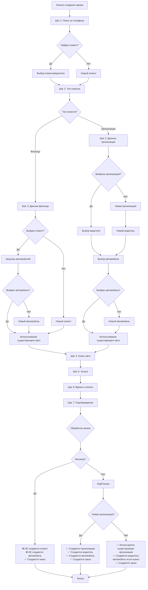
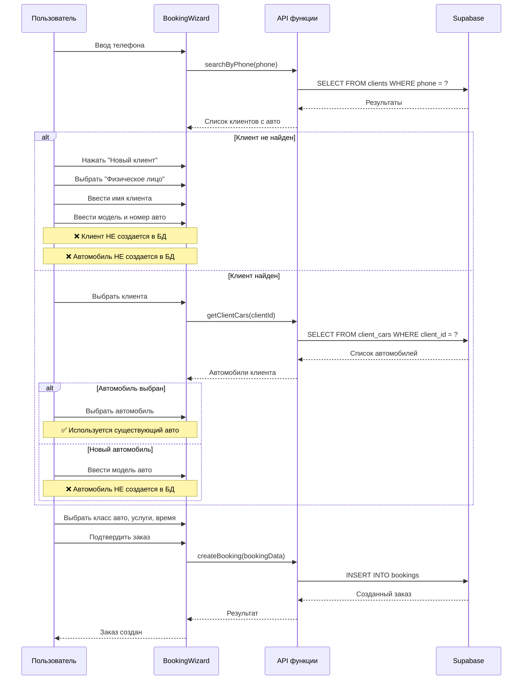
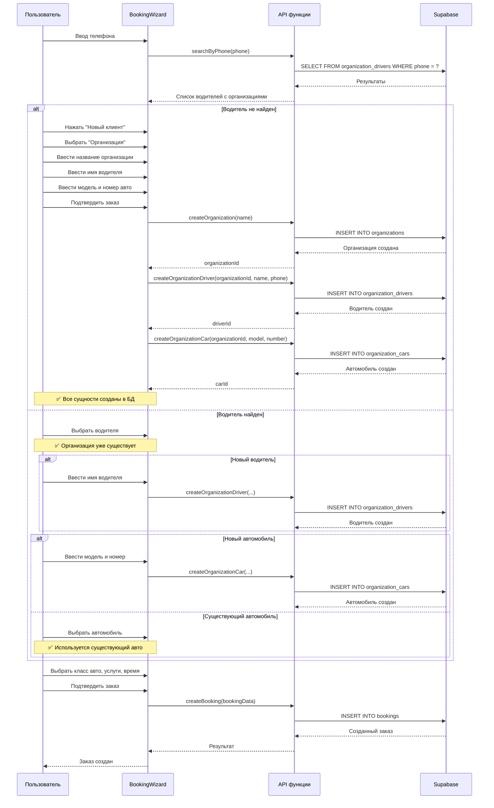

# 📋 АНАЛИЗ ЛОГИКИ СОЗДАНИЯ ЗАКАЗА

## 🎯 Обзор системы

Система поддерживает два типа клиентов:
- **Физические лица (PHYSICAL)** - обычные клиенты
- **Юридические лица (ORG)** - организации с водителями и автомобилями

---

## 📊 СХЕМА БАЗЫ ДАННЫХ

### Основные таблицы:

```
clients (физические лица)
├── id (UUID)
├── full_name
├── phone
├── is_active
└── created_at

client_cars (автомобили физлиц)
├── id (UUID)
├── client_id → clients.id
├── car_model
├── plate_number
├── car_type
└── is_active

organizations (юрлица)
├── id (UUID)
├── name
├── inn
├── contact_person
├── contact_phone
└── is_active

organization_drivers (водители организаций)
├── id (UUID)
├── organization_id → organizations.id
├── full_name
├── phone
└── is_active

organization_cars (автомобили организаций)
├── id (UUID)
├── organization_id → organizations.id
├── car_model
├── plate_number
└── is_active

bookings (заказы)
├── id (UUID)
├── client_name
├── phone
├── car_model
├── plate_number
├── car_type
├── services (JSONB)
├── price
├── payment_method
├── status
├── booking_date
├── start_time
├── end_time
├── box_number
├── worker_id
├── is_org (boolean)
├── organization_id → organizations.id
├── driver_id → organization_drivers.id
├── car_id → organization_cars.id
├── org_name
├── client_id → clients.id
├── client_car_id → client_cars.id
└── is_quick_booking
```

---

## 🔄 ПОТОК СОЗДАНИЯ ЗАКАЗА

### Шаг 1: Поиск клиента (Шаг 1 мастера)

**Функция:** [`searchByPhone()`](lib/api/search.ts:35)

**Что происходит:**
1. Пользователь вводит номер телефона в формате `+7 (XXX) XXX-XX-XX`
2. Система автоматически ищет по телефону через 500ms после остановки ввода
3. Поиск происходит в **ДВУХ** таблицах одновременно:
   - `clients` (физические лица)
   - `organization_drivers` (водители организаций)

**Результаты поиска:**
- Если найден клиент-физлицо → показывается карточка с именем и списком его автомобилей
- Если найден водитель организации → показывается карточка с именем, названием организации и списком автомобилей организации

**Выбор из результатов:**
- Можно выбрать клиента/водителя → данные заполняются автоматически
- Можно нажать "Новый клиент" → перейти к ручному вводу

---

### Шаг 2: Выбор типа клиента (Шаг 2 мастера)

**Варианты:**
1. **Физическое лицо** → работа с таблицами `clients` и `client_cars`
2. **Организация** → работа с таблицами `organizations`, `organization_drivers`, `organization_cars`

---

### Шаг 3: Ввод данных клиента (Шаг 3 мастера)

## 📋 СЦЕНАРИИ СОЗДАНИЯ ЗАКАЗА

---

## СЦЕНАРИЙ 1: Физическое лицо - НОВЫЙ клиент (не найден в базе)

### Шаги:

1. **Шаг 1 (Поиск):**
   - Вводится номер телефона
   - Поиск не находит клиента
   - Нажимается кнопка "Новый клиент"

2. **Шаг 2 (Тип клиента):**
   - Выбирается "Физическое лицо"

3. **Шаг 3 (Данные клиента):**
   - **Клиент:** Выбирается "+ Добавить клиента"
   - Вводится имя клиента (newClientName)
   - Номер телефона уже заполнен из шага 1
   - **Автомобиль:** Вводится модель и номер вручную (нет сохранения в client_cars)
   - Или выбирается "+ Добавить автомобиль" → вводится модель (newClientCarModel)

4. **Шаг 4-7:** Выбор класса авто, услуг, времени, подтверждение

5. **Обработка в App.tsx (onComplete):**
   ```typescript
   // В App.tsx:841-926
   // Физлица НЕ создаются в БД на этом этапе!
   // Данные клиента только записываются в заказ:
   - clientName → bookings.client_name
   - phone → bookings.phone
   - carModel → bookings.car_model
   - carNumber → bookings.plate_number
   - clientType = 'PHYSICAL'
   - clientId = undefined
   - clientCarId = undefined
   ```

**Итог:**
- ❌ Клиент НЕ создается в таблице `clients`
- ❌ Автомобиль НЕ создается в таблице `client_cars`
- ✅ Заказ создается в таблице `bookings` с данными клиента

---

## СЦЕНАРИЙ 2: Физическое лицо - СУЩЕСТВУЮЩИЙ клиент (найден в базе)

### Шаги:

1. **Шаг 1 (Поиск):**
   - Вводится номер телефона
   - Поиск находит клиента в таблице `clients`
   - Показывается карточка с именем клиента и списком его автомобилей

2. **Выбор клиента:**
   - Можно выбрать клиента (без авто) → переход к шагу 2
   - Можно выбрать конкретный автомобиль клиента → данные заполняются автоматически

3. **Шаг 2 (Тип клиента):**
   - Автоматически выбирается "Физическое лицо"

4. **Шаг 3 (Данные клиента):**
   - **Клиент:** Выбирается из списка (selectedClientId)
   - Загружаются автомобили клиента через [`getClientCars(clientId)`](lib/api/clients.ts:75)
   - **Автомобиль:**
     - Если выбран автомобиль из списка → заполняются модель и номер
     - Можно выбрать "+ Добавить автомобиль" → ввести новую модель (newClientCarModel)

5. **Шаг 4-7:** Выбор класса авто, услуг, времени, подтверждение

6. **Обработка в App.tsx (onComplete):**
   ```typescript
   // Физлица НЕ создаются в БД (уже существуют)
   // Данные клиента записываются в заказ:
   - clientId → bookings.client_id (ссылка на clients.id)
   - clientCarId → bookings.client_car_id (ссылка на client_cars.id)
   - clientName → bookings.client_name
   - phone → bookings.phone
   - carModel → bookings.car_model
   - carNumber → bookings.plate_number
   - clientType = 'PHYSICAL'
   ```

**Итог:**
- ✅ Клиент уже существует в таблице `clients`
- ✅ Автомобиль может существовать в таблице `client_cars` (если выбран из списка)
- ✅ Заказ создается в таблице `bookings` со ссылками на клиента и автомобиль

---

## СЦЕНАРИЙ 3: Организация - НОВАЯ организация (не найдена в базе)

### Шаги:

1. **Шаг 1 (Поиск):**
   - Вводится номер телефона водителя
   - Поиск не находит водителя
   - Нажимается кнопка "Новый клиент"

2. **Шаг 2 (Тип клиента):**
   - Выбирается "Организация"

3. **Шаг 3 (Данные организации):**
   - **Организация:** Выбирается "+ Добавить организацию"
   - Вводится название организации (newOrganizationName)
   - **Водитель:** Выбирается "+ Добавить водителя"
   - Вводится имя водителя (newDriverName)
   - Телефон водителя уже заполнен из шага 1
   - **Автомобиль:** Выбирается "+ Добавить автомобиль"
   - Вводится модель (newCarModel) и номер (newCarNumber)

4. **Шаг 4-7:** Выбор класса авто, услуг, времени, подтверждение

5. **Обработка в App.tsx (onComplete):**
   ```typescript
   // App.tsx:846-901
   
   // 1. Создаем организацию
   if (newOrganizationName) {
     const newOrg = await createOrganization({
       name: newOrganizationName
     });
     organizationId = newOrg.id;
     // Обновляем список организаций в state
     setOrganizations(prev => [...prev, newOrg]);
   }
   
   // 2. Создаем водителя
   if (newDriverName && organizationId) {
     const newDriver = await createOrganizationDriver({
       organization_id: organizationId,
       full_name: newDriverName,
       phone: newDriverPhone || null
     });
     driverId = newDriver.id;
     // Обновляем список водителей в state
     setOrganizationDrivers(prev => [...prev, newDriver]);
   }
   
   // 3. Создаем автомобиль
   if (newCarModel && newCarNumber && organizationId) {
     const newCar = await createOrganizationCar({
       organization_id: organizationId,
       car_model: newCarModel,
       plate_number: newCarNumber
     });
     carId = newCar.id;
     // Обновляем список автомобилей в state
     setOrganizationCars(prev => [...prev, newCar]);
   }
   
   // 4. Создаем заказ
   const bookingData = mapWizardDataToBooking({
     ...data,
     organizationId,  // ссылка на organizations.id
     driverId,        // ссылка на organization_drivers.id
     carId,           // ссылка на organization_cars.id
     clientName: newDriver.full_name,
     carModel: newCar.car_model,
     carNumber: newCar.plate_number
   });
   await createBooking(bookingData);
   ```

**Итог:**
- ✅ Организация создается в таблице `organizations`
- ✅ Водитель создается в таблице `organization_drivers`
- ✅ Автомобиль создается в таблице `organization_cars`
- ✅ Заказ создается в таблице `bookings` со ссылками на организацию, водителя и автомобиль

---

## СЦЕНАРИЙ 4: Организация - СУЩЕСТВУЮЩАЯ организация (найдена в базе)

### Шаги:

1. **Шаг 1 (Поиск):**
   - Вводится номер телефона водителя
   - Поиск находит водителя в таблице `organization_drivers`
   - Показывается карточка с именем водителя, названием организации и списком автомобилей

2. **Выбор водителя:**
   - Можно выбрать водителя (без авто) → переход к шагу 2
   - Можно выбрать конкретный автомобиль → данные заполняются автоматически

3. **Шаг 2 (Тип клиента):**
   - Автоматически выбирается "Организация"

4. **Шаг 3 (Данные организации):**
   - **Организация:** Выбирается из списка (selectedOrganizationId)
   - **Водитель:** Выбирается из списка водителей организации (selectedDriverId)
     - Или "+ Добавить водителя" → вводится имя (newDriverName)
   - **Автомобиль:** Выбирается из списка автомобилей организации (selectedCarId)
     - Или "+ Добавить автомобиль" → вводится модель (newCarModel) и номер (newCarNumber)

5. **Шаг 4-7:** Выбор класса авто, услуг, времени, подтверждение

6. **Обработка в App.tsx (onComplete):**
   ```typescript
   // Если выбрана существующая организация:
   organizationId = data.organizationId;  // уже существует
   
   // Если выбран существующий водитель:
   driverId = data.driverId;  // уже существует
   
   // Если выбран существующий автомобиль:
   carId = data.carId;  // уже существует
   
   // Если добавляем нового водителя:
   if (newDriverName && organizationId) {
     const newDriver = await createOrganizationDriver({...});
     driverId = newDriver.id;
   }
   
   // Если добавляем новый автомобиль:
   if (newCarModel && newCarNumber && organizationId) {
     const newCar = await createOrganizationCar({...});
     carId = newCar.id;
   }
   
   // Создаем заказ
   const bookingData = mapWizardDataToBooking({
     ...data,
     organizationId,
     driverId,
     carId,
     orgName: organizations.find(o => o.id === organizationId)?.name
   });
   await createBooking(bookingData);
   ```

**Итог:**
- ✅ Организация уже существует в таблице `organizations`
- ✅ Водитель может существовать или быть создан
- ✅ Автомобиль может существовать или быть создан
- ✅ Заказ создается в таблице `bookings` со ссылками на организацию, водителя и автомобиль

---

## 🚗 ЛОГИКА РАБОТЫ С АВТОМОБИЛЯМИ

### Добавление нового автомобиля

#### Для физического лица:

```typescript
// В BookingWizard.tsx шаг 3
// При выборе "+ Добавить автомобиль":
setIsAddingNewClientCar(true);
setNewClientCarModel('');  // вводится вручную

// При подтверждении заказа:
// ❌ Автомобиль НЕ создается в client_cars!
// Только данные записываются в заказ:
{
  carModel: newClientCarModel,
  carNumber: carNumber,  // введенный номер
  clientCarId: undefined
}
```

**Важно:** Для физлиц новый автомобиль **НЕ создается** в таблице `client_cars` при создании заказа!

#### Для организации:

```typescript
// В BookingWizard.tsx шаг 3
// При выборе "+ Добавить автомобиль":
setIsAddingNewCar(true);
setNewCarModel('');  // вводится вручную
setNewCarNumber(carNumber);  // берется из поля номера

// При подтверждении заказа (App.tsx:882-901):
if (newCarModel && newCarNumber && organizationId) {
  const newCar = await createOrganizationCar({
    organization_id: organizationId,
    car_model: newCarModel,
    plate_number: newCarNumber
  });
  carId = newCar.id;
  // Автомобиль создается в БД!
}
```

**Важно:** Для организаций новый автомобиль **СОЗДАЕТСЯ** в таблице `organization_cars`!

---

### Изменение существующего автомобиля

#### Для физического лица:

```typescript
// В BookingWizard.tsx шаг 3
// При выборе автомобиля из списка:
onValueChange={(value) => {
  setSelectedClientCarId(value);
  const car = clientCars.find(c => c.id === value);
  if (car) {
    setCarModel(car.car_model);
    setCarNumber(car.plate_number);
    // Сохраняем оригинальные значения для отслеживания изменений
    setOriginalCarModel(car.car_model);
    setOriginalCarNumber(car.plate_number);
    setIsCarModelChanged(false);
    setIsCarNumberChanged(false);
  }
}}

// При изменении модели или номера:
onChange={(e) => {
  setCarModel(e.target.value);
  // Сравниваем с оригинальным значением
  const car = clientCars.find(c => c.id === selectedClientCarId);
  if (car) {
    setIsCarModelChanged(e.target.value !== car.car_model);
  }
}}

// При подтверждении заказа (BookingWizard.tsx:1678-1687):
if (clientType === 'PHYSICAL' && selectedClientCarId && (isCarModelChanged || isCarNumberChanged)) {
  try {
    await updateClientCar(selectedClientCarId, {
      car_model: isCarModelChanged ? carModel : undefined,
      plate_number: isCarNumberChanged ? carNumber : undefined
    });
  } catch (error) {
    console.error('Ошибка при обновлении автомобиля клиента:', error);
  }
}
```

**Результат:**
- ✅ Автомобиль обновляется в таблице `client_cars` через [`updateClientCar()`](lib/api/clients.ts:123)

#### Для организации:

```typescript
// Аналогичная логика для организации:
// При выборе автомобиля из списка:
onValueChange={(value) => {
  setSelectedCarId(value);
  const car = organizationCars.find(c => c.id === value);
  if (car) {
    setCarModel(car.car_model);
    setCarNumber(car.plate_number);
    setOriginalCarModel(car.car_model);
    setOriginalCarNumber(car.plate_number);
    setIsCarModelChanged(false);
    setIsCarNumberChanged(false);
  }
}}

// При подтверждении заказа (BookingWizard.tsx:1669-1677):
if (clientType === 'ORG' && selectedCarId && (isCarModelChanged || isCarNumberChanged)) {
  try {
    await updateOrganizationCar(selectedCarId, {
      car_model: isCarModelChanged ? carModel : undefined,
      plate_number: isCarNumberChanged ? carNumber : undefined
    });
  } catch (error) {
    console.error('Ошибка при обновлении автомобиля организации:', error);
  }
}
```

**Результат:**
- ✅ Автомобиль обновляется в таблице `organization_cars` через [`updateOrganizationCar()`](lib/api/organizations.ts:322)

---

## 📝 СВОДНАЯ ТАБЛИЦА СЦЕНАРИЕВ

| Сценарий | Клиент | Автомобиль | Создается ли клиент в БД? | Создается ли авто в БД? |
|----------|--------|------------|--------------------------|-------------------------|
| **Физлицо - новый** | Новый | Новый/Существующий | ❌ Нет | ❌ Нет |
| **Физлицо - существующий** | Существующий | Существующий/Новый | ✅ Уже существует | ❌ Нет (если новый) |
| **Организация - новая** | Новая организация + новый водитель | Новый | ✅ Да (организация + водитель) | ✅ Да |
| **Организация - существующая** | Существующая организация + водитель | Существующий/Новый | ✅ Уже существует (или создается водитель) | ✅ Да (если новый) |

---

## 🔍 КЛЮЧЕВЫЕ РАЗЛИЧИЯ

### Физические лица vs Организации

| Характеристика | Физические лица | Организации |
|---------------|----------------|-------------|
| **Таблица клиентов** | `clients` | `organizations` |
| **Таблица автомобилей** | `client_cars` | `organization_cars` |
| **Таблица водителей** | Нет | `organization_drivers` |
| **Создание клиента при заказе** | ❌ Нет | ✅ Да |
| **Создание авто при заказе** | ❌ Нет | ✅ Да |
| **Обновление авто при заказе** | ✅ Да | ✅ Да |
| **Ссылки в заказе** | `client_id`, `client_car_id` | `organization_id`, `driver_id`, `car_id` |

---

## 🎯 КРИТИЧЕСКИЕ МОМЕНТЫ

### 1. Физические лица НЕ создаются автоматически

**Проблема:** При создании заказа для нового физического лица, клиент НЕ создается в таблице `clients`.

**Текущее поведение:**
```typescript
// App.tsx:841-926
// Нет вызова createClient() для физлиц!
// Только данные записываются в заказ:
{
  clientName: "Иван Иванов",
  phone: "+7 (999) 123-45-67",
  clientId: undefined  // ❌ Нет ссылки на клиента
}
```

**Потенциальные проблемы:**
- При следующем заказе этого клиента его снова не найдут в базе
- Нет истории заказов по клиенту
- Нельзя посмотреть все автомобили клиента

---

### 2. Автомобили физлиц НЕ создаются автоматически

**Проблема:** При создании заказа для физического лица с новым автомобилем, автомобиль НЕ создается в таблице `client_cars`.

**Текущее поведение:**
```typescript
// App.tsx:841-926
// Нет вызова createClientCar() для физлиц!
// Только данные записываются в заказ:
{
  carModel: "Toyota Camry",
  carNumber: "А123АА",
  clientCarId: undefined  // ❌ Нет ссылки на автомобиль
}
```

**Потенциальные проблемы:**
- При следующем заказе этого клиента с тем же авто его снова не найдут
- Нет истории автомобилей клиента

---

### 3. Организации создаются корректно

**Хорошее поведение:** При создании заказа для новой организации, все сущности создаются правильно.

```typescript
// App.tsx:846-901
// 1. Создается организация
const newOrg = await createOrganization({ name: newOrganizationName });

// 2. Создается водитель
const newDriver = await createOrganizationDriver({
  organization_id: organizationId,
  full_name: newDriverName,
  phone: newDriverPhone
});

// 3. Создается автомобиль
const newCar = await createOrganizationCar({
  organization_id: organizationId,
  car_model: newCarModel,
  plate_number: newCarNumber
});

// 4. Создается заказ со ссылками
await createBooking({
  organization_id: organizationId,
  driver_id: driverId,
  car_id: carId
});
```

---

## 📊 ДИАГРАММА ПОТОКА ДАННЫХ



---

## 🔄 ДЕТАЛЬНЫЙ ПОТОК ДЛЯ ФИЗЛИЦ



---

## 🔄 ДЕТАЛЬНЫЙ ПОТОК ДЛЯ ОРГАНИЗАЦИЙ



---

## 🎯 ВЫВОДЫ И РЕКОМЕНДАЦИИ

### Проблемы:

1. **Физические лица не создаются автоматически**
   - При создании заказа для нового физического лица, клиент НЕ сохраняется в БД
   - Это приводит к потере данных о клиенте
   - При следующем заказе клиента снова не найдут

2. **Автомобили физлиц не создаются автоматически**
   - При создании заказа с новым автомобилем физлица, авто НЕ сохраняется в БД
   - Нет истории автомобилей клиента

### Рекомендации:

1. **Добавить создание клиентов физлиц**
   ```typescript
   // В App.tsx:841-926, добавить:
   if (clientType === 'PHYSICAL' && isAddingNewClient && newClientName) {
     const newClient = await createClient({
       full_name: newClientName,
       phone: phone
     });
     clientId = newClient.id;
   }
   ```

2. **Добавить создание автомобилей физлиц**
   ```typescript
   // В App.tsx:841-926, добавить:
   if (clientType === 'PHYSICAL' && clientId && isAddingNewClientCar && newClientCarModel) {
     const newCar = await createClientCar({
       client_id: clientId,
       car_model: newClientCarModel,
       plate_number: carNumber,
       car_type: selectedCarClass
     });
     clientCarId = newCar.id;
   }
   ```

3. **Унифицировать логику для физлиц и организаций**
   - Оба типа клиентов должны создаваться автоматически
   - Оба типа автомобилей должны создаваться автоматически
   - Это обеспечит целостность данных и историю клиентов

---

## 📚 ССЫЛКИ НА КОД

- **BookingWizard.tsx:** [`components/admin/BookingWizard.tsx`](components/admin/BookingWizard.tsx:1)
- **API клиентов:** [`lib/api/clients.ts`](lib/api/clients.ts:1)
- **API организаций:** [`lib/api/organizations.ts`](lib/api/organizations.ts:1)
- **API поиска:** [`lib/api/search.ts`](lib/api/search.ts:1)
- **API заказов:** [`lib/api/bookings.ts`](lib/api/bookings.ts:1)
- **App.tsx:** [`App.tsx`](App.tsx:841-926)

---

## 🔧 ПОЛЕЗНЫЕ ФУНКЦИИ

### Поиск по телефону
```typescript
// lib/api/search.ts:35
export async function searchByPhone(phone: string): Promise<SearchResult[]>
```

### Создание клиента
```typescript
// lib/api/clients.ts:48
export async function createClient(data: {
  full_name: string
  phone: string
  notes?: string
}): Promise<Client>
```

### Создание автомобиля клиента
```typescript
// lib/api/clients.ts:94
export async function createClientCar(data: {
  client_id: string
  car_model: string
  plate_number: string
  car_type: string
}): Promise<ClientCar>
```

### Обновление автомобиля клиента
```typescript
// lib/api/clients.ts:123
export async function updateClientCar(
  id: string,
  data: Partial<Omit<ClientCar, 'id' | 'created_at'>>
): Promise<ClientCar>
```

### Создание организации
```typescript
// lib/api/organizations.ts:43
export async function createOrganization(data: {
  name: string
  inn?: string
  contact_person?: string
  contact_phone?: string
  notes?: string
}): Promise<Organization>
```

### Создание водителя организации
```typescript
// lib/api/organizations.ts:219
export async function createOrganizationDriver(data: {
  organization_id: string
  full_name: string
  phone?: string
}): Promise<OrganizationDriver>
```

### Создание автомобиля организации
```typescript
// lib/api/organizations.ts:295
export async function createOrganizationCar(data: {
  organization_id: string
  car_model: string
  plate_number: string
}): Promise<OrganizationCar>
```

### Обновление автомобиля организации
```typescript
// lib/api/organizations.ts:322
export async function updateOrganizationCar(
  id: string,
  data: Partial<Omit<OrganizationCar, 'id' | 'created_at'>>
): Promise<OrganizationCar>
```

### Создание заказа
```typescript
// lib/api/bookings.ts:71
export async function createBooking(
  booking: Omit<Booking, 'id' | 'created_at' | 'updated_at'>
): Promise<Booking>
```

---

## 📝 ЗАМЕЧАНИЯ ПО КОДУ

### 1. BookingWizard.tsx:154
```typescript
clients = []  // ❌ Не передается пропс clients!
```
**Проблема:** Пропс `clients` не определен в интерфейсе `BookingWizardProps`, но используется в компоненте.

### 2. App.tsx:830
```typescript
clients={clients}  // ✅ Передается
```
**Решение:** Добавить `clients` в интерфейс `BookingWizardProps`.

### 3. Отсутствие валидации
- Нет проверки на дубликаты номеров автомобилей
- Нет проверки на дубликаты телефонов

### 4. Обработка ошибок
- Ошибки при создании сущностей логируются, но не показываются пользователю
- Продолжается создание заказа без созданных сущностей

---

## 🎯 ИТОГОВОЕ РЕЗЮМЕ

### Что работает хорошо:
✅ Организации создаются полностью (организация + водитель + автомобиль)
✅ Поиск работает универсально (физлица + организации)
✅ Автомобили обновляются корректно
✅ Ссылки в заказах сохраняются правильно

### Что нужно исправить:
❌ Физические лица не создаются автоматически
❌ Автомобили физлиц не создаются автоматически
❌ Нет валидации дубликатов
❌ Нет обработки ошибок для пользователя

### Приоритеты:
1. **Высокий:** Добавить создание клиентов физлиц
2. **Высокий:** Добавить создание автомобилей физлиц
3. **Средний:** Добавить валидацию дубликатов
4. **Низкий:** Улучшить обработку ошибок
