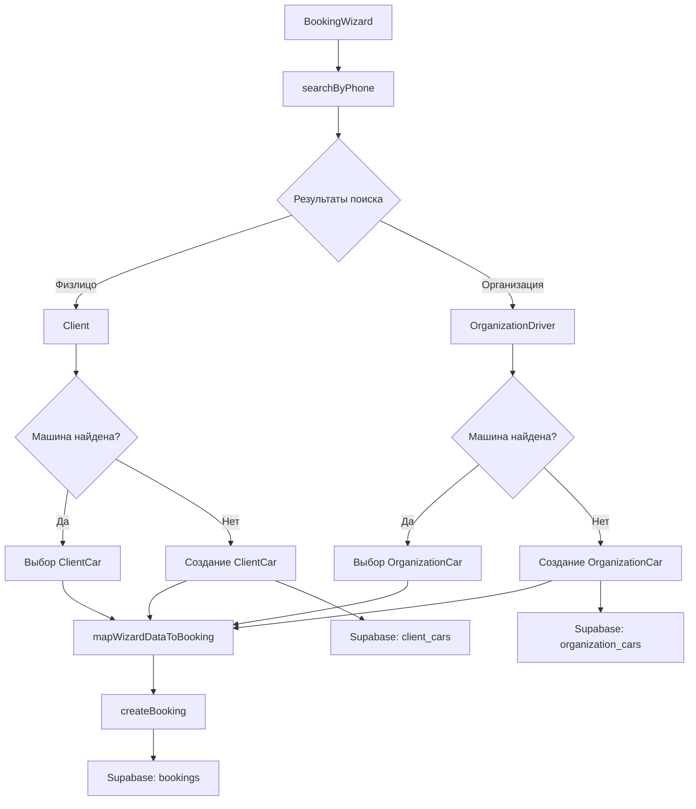

# План интеграции физлиц с БД (ИСПРАВЛЕННЫЙ)

## 📋 Обзор задачи

**Цель:** Подключить физлиц к базе данных Supabase и интегрировать их в систему управления заказами.

**Текущее состояние:**
- ✅ Таблицы созданы в Supabase: `clients`, `client_cars`
- ✅ Таблица `bookings` имеет поля `client_id` и `client_car_id`
- ✅ Система уже поддерживает организации (organizations, organization_drivers, organization_cars)

**Что нужно сделать:**
- Создать API функции для работы с клиентами
- Создать универсальный поиск по телефону (физлица + организации)
- Обновить BookingWizard для поддержки выбора физлица
- **НЕ создавать админку управления клиентами - потом!**

---

## 🗂️ Структура базы данных

### Таблица `clients` (физлица)
```sql
CREATE TABLE clients (
  id UUID PRIMARY KEY DEFAULT gen_random_uuid(),
  full_name VARCHAR NOT NULL,
  phone VARCHAR NOT NULL,
  is_active BOOLEAN DEFAULT true,
  notes TEXT,
  created_at TIMESTAMP DEFAULT NOW(),
  updated_at TIMESTAMP DEFAULT NOW()
);

-- Индекс для быстрого поиска по телефону
CREATE INDEX idx_clients_phone ON clients(phone);
CREATE INDEX idx_clients_full_name ON clients(full_name);
```

### Таблица `client_cars` (машины физлиц)
```sql
CREATE TABLE client_cars (
  id UUID PRIMARY KEY DEFAULT gen_random_uuid(),
  client_id UUID NOT NULL REFERENCES clients(id) ON DELETE CASCADE,
  car_model VARCHAR NOT NULL,
  plate_number VARCHAR NOT NULL,
  car_type VARCHAR NOT NULL,
  is_active BOOLEAN DEFAULT true,
  created_at TIMESTAMP DEFAULT NOW()
);

-- Индексы
CREATE INDEX idx_client_cars_client_id ON client_cars(client_id);
CREATE INDEX idx_client_cars_plate_number ON client_cars(plate_number);
```

### Связь с таблицей `bookings`
```sql
ALTER TABLE bookings
ADD COLUMN client_id UUID REFERENCES clients(id) ON DELETE SET NULL,
ADD COLUMN client_car_id UUID REFERENCES client_cars(id) ON DELETE SET NULL;

CREATE INDEX idx_bookings_client_id ON bookings(client_id);
CREATE INDEX idx_bookings_client_car_id ON bookings(client_car_id);
```

---

## 📐 Архитектура решения



---

## 📝 Детальный план реализации

### Шаг 1: Создать lib/api/clients.ts (ТИПЫ + CRUD в ОДНОМ файле)

**Файл:** `lib/api/clients.ts`

```typescript
import { supabase } from '../supabase'

// ✅ ТИПЫ ЗДЕСЬ (НЕ в entities/)

export interface Client {
  id: string
  full_name: string
  phone: string
  is_active: boolean
  notes?: string
  created_at: string
  updated_at: string
}

export interface ClientCar {
  id: string
  client_id: string
  car_model: string
  plate_number: string
  car_type: string
  is_active: boolean
  created_at: string
}

// CRUD ФУНКЦИИ

/**
 * Получить всех активных клиентов
 */
export async function getClients(): Promise<Client[]> {
  const { data, error } = await supabase
    .from('clients')
    .select('*')
    .eq('is_active', true)
    .order('full_name', { ascending: true })

  if (error) {
    console.error('Ошибка при загрузке клиентов:', error)
    throw error
  }

  return data || []
}

/**
 * Создать нового клиента
 */
export async function createClient(data: {
  full_name: string
  phone: string
  notes?: string
}): Promise<Client> {
  const { data: newClient, error } = await supabase
    .from('clients')
    .insert({
      full_name: data.full_name.trim(),
      phone: data.phone.trim(),
      notes: data.notes?.trim() || null,
      is_active: true
    })
    .select()
    .single()

  if (error) {
    console.error('Ошибка при создании клиента:', error)
    throw error
  }

  return newClient
}

/**
 * Получить все автомобили клиента
 */
export async function getClientCars(clientId: string): Promise<ClientCar[]> {
  const { data, error } = await supabase
    .from('client_cars')
    .select('*')
    .eq('client_id', clientId)
    .eq('is_active', true)
    .order('car_model', { ascending: true })

  if (error) {
    console.error('Ошибка при загрузке автомобилей клиентов:', error)
    throw error
  }

  return data || []
}

/**
 * Создать новый автомобиль клиента
 */
export async function createClientCar(data: {
  client_id: string
  car_model: string
  plate_number: string
  car_type: string
}): Promise<ClientCar> {
  const { data: newCar, error } = await supabase
    .from('client_cars')
    .insert({
      client_id: data.client_id,
      car_model: data.car_model.trim(),
      plate_number: data.plate_number.trim().toUpperCase(),
      car_type: data.car_type.trim(),
      is_active: true
    })
    .select()
    .single()

  if (error) {
    console.error('Ошибка при создании автомобиля клиента:', error)
    throw error
  }

  return newCar
}

/**
 * Найти клиента по телефону (простой поиск)
 */
export async function findClientByPhone(phone: string): Promise<Client | null> {
  const { data, error } = await supabase
    .from('clients')
    .select('*')
    .eq('phone', phone)
    .eq('is_active', true)
    .single()

  // PGRST116 = not found, это нормально
  if (error && error.code !== 'PGRST116') {
    console.error('Ошибка при поиске клиента:', error)
    throw error
  }

  return data as Client | null
}
```

---

### Шаг 2: Создать lib/api/search.ts (УНИВЕРСАЛЬНЫЙ ПОИСК)

**Файл:** `lib/api/search.ts`

```typescript
import { supabase } from '../supabase'

export interface SearchResult {
  type: 'client' | 'organization'

  // Для физлиц
  client_id?: string
  client_name?: string

  // Для юрлиц
  organization_id?: string
  organization_name?: string
  driver_id?: string
  driver_name?: string

  // Общее
  phone: string
}

/**
 * Универсальный поиск по телефону
 * Ищет ОДНОВРЕМЕННО в clients и organization_drivers
 */
export async function searchByPhone(phone: string): Promise<SearchResult[]> {
  const results: SearchResult[] = []

  // Поиск в физлицах
  const { data: clients, error: clientsError } = await supabase
    .from('clients')
    .select('*')
    .eq('phone', phone)
    .eq('is_active', true)

  if (clientsError) {
    console.error('Ошибка при поиске в clients:', clientsError)
  } else if (clients && clients.length > 0) {
    clients.forEach((client: any) => {
      results.push({
        type: 'client',
        client_id: client.id,
        client_name: client.full_name,
        phone: client.phone
      })
    })
  }

  // Поиск в водителях организаций
  const { data: drivers, error: driversError } = await supabase
    .from('organization_drivers')
    .select(`
      id,
      full_name,
      phone,
      organization_id,
      organizations!inner(id, name)
    `)
    .eq('phone', phone)
    .eq('is_active', true)

  if (driversError) {
    console.error('Ошибка при поиске в organization_drivers:', driversError)
  } else if (drivers && drivers.length > 0) {
    drivers.forEach((driver: any) => {
      results.push({
        type: 'organization',
        organization_id: driver.organization_id,
        organization_name: driver.organizations.name,
        driver_id: driver.id,
        driver_name: driver.full_name,
        phone: driver.phone
      })
    })
  }

  return results
}
```

---

### Шаг 3: Обновить Booking интерфейс

**Файл:** `lib/api/bookings.ts`

```typescript
export interface Booking {
  id: string
  client_name: string
  phone?: string
  car_model: string
  plate_number: string
  car_type: string
  services: string[]
  price: number
  payment_method?: string
  status: string
  booking_date: string
  start_time?: string
  end_time?: string
  box_number?: number
  worker_id?: string
  working_mode?: string
  is_org: boolean
  organization_id?: string
  driver_id?: string
  car_id?: string
  org_name?: string

  // ✅ Новые поля для физлиц
  client_id?: string
  client_car_id?: string

  signature_obtained: boolean
  signed_at?: string
  is_quick_booking: boolean
  completed_at?: string
  cancel_comment?: string
  created_at: string
  updated_at: string
}
```

---

### Шаг 4: Обновить BookingWizard - добавить импорты и типы

**Файл:** `components/admin/BookingWizard.tsx`

```typescript
// Добавить импорты
import { searchByPhone } from '../../lib/api/search'
import { SearchResult } from '../../lib/api/search'
import {
  Client,
  ClientCar,
  getClientCars,
  createClient,
  createClientCar
} from '../../lib/api/clients'

// Обновить интерфейс BookingWizardData
export interface BookingWizardData {
  clientName: string
  phone: string
  carModel: string
  carNumber: string
  carType: CarType | null
  price: number
  services: string[]
  clientType: 'PHYSICAL' | 'ORG'
  selectedHour: number | undefined
  selectedBoxNumber: number | undefined
  selectedWorkerId: string | undefined
  paymentType: 'Наличный' | 'Безналичный' | 'Перевод'
  date: string
  isQuickBooking?: boolean
  orgName?: string
  organizationId?: string
  driverId?: string
  carId?: string
  newOrganizationName?: string
  newDriverName?: string
  newDriverPhone?: string
  newCarModel?: string
  newCarNumber?: string

  // ✅ Новые поля для физлиц
  clientId?: string
  clientCarId?: string
  isAddingNewClient?: boolean
  newClientName?: string
  isAddingNewClientCar?: boolean
  newClientCarModel?: string
}
```

---

### Шаг 5: Обновить BookingWizard - добавить состояние

```typescript
// Добавить состояние в компонент
const [searchResults, setSearchResults] = useState<SearchResult[]>([])
const [selectedClientId, setSelectedClientId] = useState<string | null>(null)
const [selectedClientCarId, setSelectedClientCarId] = useState<string | null>(null)
const [isAddingNewClient, setIsAddingNewClient] = useState(false)
const [newClientName, setNewClientName] = useState('')
const [isAddingNewClientCar, setIsAddingNewClientCar] = useState(false)
const [newClientCarModel, setNewClientCarModel] = useState('')
const [clientCars, setClientCars] = useState<ClientCar[]>([])
```

---

### Шаг 6: Обновить BookingWizard - добавить useEffect для поиска

```typescript
// Поиск по телефону (универсальный - физлица + организации)
React.useEffect(() => {
  const search = async () => {
    // Ищем только если номер телефона полный (12 символов: +7 XXX XXX-XX-XX)
    if (phone.length === 12) {
      try {
        const results = await searchByPhone(phone)
        setSearchResults(results)
      } catch (error) {
        console.error('Ошибка при поиске:', error)
        setSearchResults([])
      }
    } else {
      setSearchResults([])
    }
  }

  const timer = setTimeout(search, 500)
  return () => clearTimeout(timer)
}, [phone])
```

---

### Шаг 7: Обновить BookingWizard - показать результаты поиска (шаг 1)

**Заменить существующий UI поиска на универсальный:**

```typescript
{step === 1 && (
  <div className="space-y-6 animate-in slide-in-from-right duration-300">
    <h3 className="text-xl font-bold">Найти клиента</h3>
    <div className="space-y-4">
      <Label>Номер телефона</Label>
      <div className="flex gap-2 items-center">
        <Input
          placeholder="+7 (___) ___-__-__"
          value={phone}
          onChange={(e) => {
            const formatted = formatPhoneNumber(e.target.value)
            if (formatted.startsWith('+7 ') || formatted === '+7') {
              setPhone(formatted)
            } else if (formatted === '') {
              setPhone('+7 ')
            }
          }}
          className="text-lg tracking-wider h-12"
        />
        <Button size="icon" className="h-12 w-12 rounded-md shrink-0">
          <Search className="w-5 h-5" />
        </Button>
      </div>

      {/* ✅ Универсальные результаты поиска */}
      {searchResults.length > 0 && (
        <div className="space-y-3">
          <div className="text-sm text-gray-600 font-medium">
            Найдено: {searchResults.length}
          </div>
          {searchResults.map((result, index) => (
            <Card
              key={`${result.type}-${index}`}
              className="border-primary bg-blue-50/50 cursor-pointer hover:bg-blue-100/50 transition-colors"
              onClick={() => handleSelectSearchResult(result)}
            >
              <CardContent className="p-4">
                <div className="flex justify-between items-start">
                  <div>
                    {result.type === 'client' ? (
                      <>
                        <div className="font-bold text-lg flex items-center gap-2">
                          <User className="w-5 h-5" />
                          {result.client_name}
                        </div>
                        <div className="text-sm text-gray-600">{result.phone}</div>
                      </>
                    ) : (
                      <>
                        <div className="font-bold text-lg flex items-center gap-2">
                          <Building2 className="w-5 h-5" />
                          {result.driver_name}
                        </div>
                        <div className="text-sm text-gray-600">{result.organization_name}</div>
                        <div className="text-sm text-gray-600">{result.phone}</div>
                      </>
                    )}
                  </div>
                  <div className="w-6 h-6 bg-primary rounded-full flex items-center justify-center shrink-0">
                    <Check className="w-4 h-4 text-white" />
                  </div>
                </div>
              </CardContent>
            </Card>
          ))}
        </div>
      )}

      <div className="relative my-6">
        <div className="absolute inset-0 flex items-center">
          <span className="w-full border-t" />
        </div>
        <div className="relative flex justify-center text-xs uppercase">
          <span className="bg-[#f5f5f5] px-2 text-muted-foreground">Или</span>
        </div>
      </div>

      <Button variant="outline" className="w-full h-12" onClick={nextStep}>
        <PlusIcon className="w-4 h-4 mr-2" />
        Новый клиент
      </Button>
    </div>
  </div>
)}
```

---

### Шаг 8: Обновить BookingWizard - обработчик выбора результата поиска

```typescript
const handleSelectSearchResult = async (result: SearchResult) => {
  if (result.type === 'client') {
    // Выбрано физлицо
    setSelectedClientId(result.client_id!)
    setClientName(result.client_name!)
    setPhone(result.phone)
    setClientType('PHYSICAL')

    // Загрузить автомобили клиента
    try {
      const cars = await getClientCars(result.client_id!)
      setClientCars(cars)
      setSelectedClientCarId(null)
      setIsAddingNewClientCar(false)
    } catch (error) {
      console.error('Ошибка при загрузке автомобилей клиента:', error)
      setClientCars([])
    }

    // Если есть только одна машина, выбрать её автоматически
    if (clientCars.length === 1) {
      setSelectedClientCarId(clientCars[0].id)
      setCarModel(clientCars[0].car_model)
      setCarNumber(clientCars[0].plate_number)
    }

    setStep(2)
  } else {
    // Выбрана организация
    setSelectedOrganizationId(result.organization_id!)
    setSelectedDriverId(result.driver_id!)
    setClientName(result.driver_name!)
    setPhone(result.phone)
    setClientType('ORG')

    // Сбросить выбор автомобиля
    setSelectedCarId(null)
    setIsAddingNewCar(false)

    setStep(2)
  }
}
```

---

### Шаг 9: Обновить BookingWizard - шаг 3 для физлиц (выбор клиента и машины)

```typescript
{step === 3 && (
  <div className="space-y-6 animate-in slide-in-from-right duration-300">
    <h3 className="text-xl font-bold">
      {clientType === 'ORG' && isAddingNewOrganization ? 'Данные организации' : 'Данные клиента'}
    </h3>
    <div className="space-y-4">

      {/* ✅ Блок для физлиц */}
      {clientType === 'PHYSICAL' && (
        <>
          {/* Выбор клиента */}
          <div className="space-y-2">
            <Label>Клиент</Label>
            {!isAddingNewClient ? (
              <div className="flex gap-2">
                <Select
                  value={selectedClientId || undefined}
                  onValueChange={(value) => {
                    if (value === 'add-new') {
                      setIsAddingNewClient(true)
                      setSelectedClientId(null)
                      setNewClientName('')
                    } else {
                      setIsAddingNewClient(false)
                      setSelectedClientId(value)
                      // Загрузить автомобили клиента
                      getClientCars(value).then(setClientCars)
                      setSelectedClientCarId(null)
                    }
                  }}
                >
                  <SelectTrigger className="h-14 flex-1">
                    <SelectValue placeholder="Выберите клиента..." />
                  </SelectTrigger>
                  <SelectContent>
                    {searchResults
                      .filter(r => r.type === 'client')
                      .map((result) => (
                        <SelectItem key={result.client_id} value={result.client_id!}>
                          {result.client_name}
                        </SelectItem>
                      ))}
                    <SelectItem value="add-new" className="font-bold text-primary">
                      + Добавить клиента
                    </SelectItem>
                  </SelectContent>
                </Select>
              </div>
            ) : (
              <div className="flex gap-2">
                <Input
                  placeholder="Имя клиента..."
                  value={newClientName}
                  onChange={(e) => setNewClientName(e.target.value)}
                  className="h-14 flex-1"
                  autoFocus
                />
                <Button
                  type="button"
                  variant="outline"
                  size="icon"
                  className="h-14 w-14"
                  onClick={() => {
                    setIsAddingNewClient(false)
                    setNewClientName('')
                  }}
                >
                  <ArrowLeft className="w-5 h-5" />
                </Button>
              </div>
            )}
          </div>

          {/* Выбор автомобиля клиента */}
          {selectedClientId && (
            <div className="space-y-2">
              <Label>Автомобиль</Label>
              {!isAddingNewClientCar ? (
                <div className="flex gap-2">
                  <Select
                    value={selectedClientCarId || undefined}
                    onValueChange={(value) => {
                      if (value === 'add-new') {
                        setIsAddingNewClientCar(true)
                        setSelectedClientCarId(null)
                        setNewClientCarModel('')
                      } else {
                        setIsAddingNewClientCar(false)
                        setSelectedClientCarId(value)
                        const car = clientCars.find(c => c.id === value)
                        if (car) {
                          setCarModel(car.car_model)
                          setCarNumber(car.plate_number)
                        }
                      }
                    }}
                  >
                    <SelectTrigger className="h-14 flex-1">
                      <SelectValue placeholder="Выберите автомобиль..." />
                    </SelectTrigger>
                    <SelectContent>
                      {clientCars.map((car) => (
                        <SelectItem key={car.id} value={car.id}>
                          {car.car_model} ({car.plate_number})
                        </SelectItem>
                      ))}
                      <SelectItem value="add-new" className="font-bold text-primary">
                        + Добавить автомобиль
                      </SelectItem>
                    </SelectContent>
                  </Select>
                </div>
              ) : (
                <div className="flex gap-2">
                  <Input
                    placeholder="Модель автомобиля..."
                    value={newClientCarModel}
                    onChange={(e) => setNewClientCarModel(e.target.value)}
                    className="h-14 flex-1"
                    autoFocus
                  />
                  <Button
                    type="button"
                    variant="outline"
                    size="icon"
                    className="h-14 w-14"
                    onClick={() => {
                      setIsAddingNewClientCar(false)
                      setNewClientCarModel('')
                    }}
                  >
                    <ArrowLeft className="w-5 h-5" />
                  </Button>
                </div>
              )}
            </div>
          )}

          {/* Номер телефона (для физлиц) */}
          <div className="space-y-2">
            <Label>Номер телефона</Label>
            <Input
              placeholder="+7 (___) ___-__-__"
              value={phone}
              onChange={(e) => {
                const formatted = formatPhoneNumber(e.target.value)
                setPhone(formatted)
              }}
              className="text-lg tracking-wider h-12"
            />
          </div>

          {/* Имя клиента (только если добавляем нового) */}
          {isAddingNewClient && (
            <div className="space-y-2">
              <Label>Имя клиента</Label>
              <Input
                placeholder="Иван Иванов"
                value={newClientName}
                onChange={(e) => setNewClientName(e.target.value)}
                className="h-12"
              />
            </div>
          )}

          {/* Модель авто (для физлиц или если добавляем новую машину) */}
          {(!selectedClientCarId || isAddingNewClientCar) && (
            <div className="space-y-2">
              <Label>Модель автомобиля</Label>
              <Input
                placeholder="Toyota Camry"
                value={carModel}
                onChange={(e) => setCarModel(e.target.value)}
                className="h-12"
              />
            </div>
          )}

          {/* Гос номер (для физлиц или если добавляем новую машину) */}
          {(!selectedClientCarId || isAddingNewClientCar) && (
            <div className="space-y-2">
              <Label>Гос. номер</Label>
              <Input
                placeholder="А123АА"
                value={carNumber}
                onChange={(e) => {
                  const formatted = formatCarNumber(e.target.value)
                  setCarNumber(formatted)
                }}
                className="uppercase h-12"
              />
            </div>
          )}
        </>
      )}

      {/* ✅ Блок для организаций (существующий код) */}
      {clientType === 'ORG' && (
        // ... существующий код для организаций без изменений
      )}

      <Button className="w-full h-12 mt-4" onClick={nextStep}>
        Далее
      </Button>
    </div>
  </div>
)}
```

---

### Шаг 10: Обновить mapWizardDataToBooking

```typescript
export function mapWizardDataToBooking(
  data: BookingWizardData
): Omit<Booking, 'id' | 'created_at' | 'updated_at'> {
  const isQuickBooking = data.isQuickBooking || false
  let startTime: string | undefined
  let endTime: string | undefined

  if (isQuickBooking) {
    const now = new Date()
    const end = new Date(now.getTime() + 30 * 60 * 1000)

    const formatTime = (date: Date) => {
      const hours = String(date.getHours()).padStart(2, '0')
      const minutes = String(date.getMinutes()).padStart(2, '0')
      return `${hours}:${minutes}`
    }

    startTime = formatTime(now)
    endTime = formatTime(end)
  } else {
    startTime = data.selectedHour ? `${String(data.selectedHour).padStart(2, '0')}:00` : undefined
    endTime = data.selectedHour ? `${String(data.selectedHour + 1).padStart(2, '0')}:00` : undefined
  }

  return {
    client_name: data.clientName,
    phone: data.phone,
    car_model: data.carModel,
    plate_number: data.carNumber,
    car_type: data.carType ?? 'SEDAN',
    services: data.services,
    price: data.price,
    payment_method: data.paymentType,
    status: 'ОЖИДАЕТ',
    booking_date: data.date || formatDate(new Date()),
    start_time: startTime,
    end_time: endTime,
    box_number: data.selectedBoxNumber,
    worker_id: data.selectedWorkerId,
    is_org: data.clientType === 'ORG',
    organization_id: data.clientType === 'ORG' ? data.organizationId : undefined,
    driver_id: data.clientType === 'ORG' ? data.driverId : undefined,
    car_id: data.clientType === 'ORG' ? data.carId : undefined,
    org_name: data.orgName,

    // ✅ Новые поля для физлиц
    client_id: data.clientType === 'PHYSICAL' ? data.clientId : undefined,
    client_car_id: data.clientType === 'PHYSICAL' ? data.clientCarId : undefined,

    signature_obtained: false,
    is_quick_booking: isQuickBooking
  }
}
```


## ✅ ЧЕКЛИСТ ПЕРЕД РЕАЛИЗАЦИЕЙ

- [ ] lib/api/clients.ts создан (типы + CRUD)
- [ ] lib/api/search.ts создан (searchByPhone)
- [ ] Booking интерфейс обновлен (client_id, client_car_id)
- [ ] BookingWizard импорты обновлены
- [ ] BookingWizard состояние обновлено
- [ ] useEffect для поиска добавлен
- [ ] UI результатов поиска обновлен
- [ ] handleSelectSearchResult реализован
- [ ] Шаг 3 для физлиц обновлен
- [ ] mapWizardDataToBooking обновлен
- [ ] Тестирование пройдено

