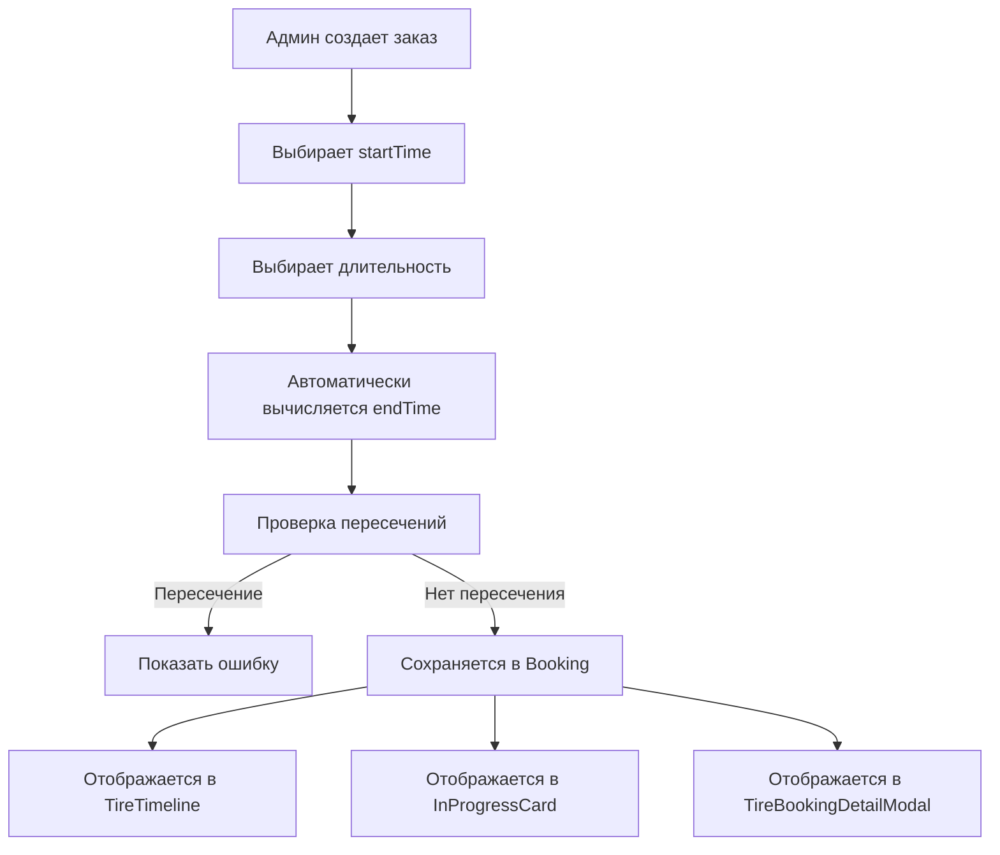

# План реализации: Временной интервал для записей на шиномонтаж

## 📋 Обзор задачи

Нужно добавить возможность указывать время начала и окончания выполнения заказа на шиномонтаж. Админ при создании заказа спрашивает у шиномонтажника сколько времени потребуется на заказ (например, 1 час) и устанавливает временной интервал (например, с 15:00 до 16:00).

**Дополнительные требования:**
- Быстрый выбор длительности (30 мин, 1 час, 1.5 ч, 2 часа)
- Проверка пересечений заказов по времени

В расписании должны отображаться интервалы, и сортировка должна учитывать эти интервалы.

---

## 🎯 Текущее состояние

### ✅ Уже есть в типах:
```typescript
// types.ts - Booking interface
export interface Booking {
  id: string;
  // ... другие поля
  startTime: string; // HH:mm - уже есть!
  endTime: string;   // HH:mm - уже есть!
  // ... другие поля
}
```

### ❌ Проблемы:
1. В `CreateTireBookingModal.tsx` (строка 197): `endTime: time` - всегда равен startTime
2. В `TireBookingWizard.tsx` (строка 23): нет поля `endTime` в интерфейсе
3. В `TireTimeline.tsx`: отображается только `startTime`, сортировка только по `startTime`
4. В `TireBookingDetailModal.tsx`: отображается только `startTime`
5. В `InProgressCard.tsx`: отображается только `startTime`
6. Нет проверки пересечений заказов

---

## 📊 Диаграмма потока данных



---

## 📝 Детальный план реализации

### Шаг 1: Создать утилиту для работы со временем
**Файл:** `shared/utils/time.ts` (новый файл)

```typescript
/**
 * Добавляет минуты к времени в формате HH:mm
 * @param time - время в формате HH:mm
 * @param minutes - количество минут для добавления
 * @returns время в формате HH:mm
 */
export function addMinutesToTime(time: string, minutes: number): string {
  const [hours, mins] = time.split(':').map(Number);
  const totalMinutes = hours * 60 + mins + minutes;
  const newHours = Math.floor(totalMinutes / 60) % 24;
  const newMins = totalMinutes % 60;
  return `${String(newHours).padStart(2, '0')}:${String(newMins).padStart(2, '0')}`;
}

/**
 * Проверяет пересечение двух временных интервалов
 * @param start1 - начало первого интервала (HH:mm)
 * @param end1 - конец первого интервала (HH:mm)
 * @param start2 - начало второго интервала (HH:mm)
 * @param end2 - конец второго интервала (HH:mm)
 * @returns true если интервалы пересекаются
 */
export function isTimeOverlap(
  start1: string,
  end1: string,
  start2: string,
  end2: string
): boolean {
  const timeToMinutes = (time: string) => {
    const [h, m] = time.split(':').map(Number);
    return h * 60 + m;
  };

  const s1 = timeToMinutes(start1);
  const e1 = timeToMinutes(end1);
  const s2 = timeToMinutes(start2);
  const e2 = timeToMinutes(end2);

  return s1 < e2 && s2 < e1;
}

/**
 * Проверяет пересечение нового заказа с существующими
 * @param startTime - время начала нового заказа
 * @param endTime - время окончания нового заказа
 * @param existingBookings - существующие заказы
 * @param date - дата заказа
 * @param excludeBookingId - ID заказа который нужно исключить из проверки
 * @returns массив заказов с которыми есть пересечение
 */
export function findOverlappingBookings(
  startTime: string,
  endTime: string,
  existingBookings: Array<{ id: string; startTime: string; endTime: string; date: string }>,
  date: string,
  excludeBookingId?: string
): Array<{ id: string; startTime: string; endTime: string }> {
  return existingBookings.filter(booking => {
    if (booking.date !== date) return false;
    if (excludeBookingId && booking.id === excludeBookingId) return false;
    return isTimeOverlap(startTime, endTime, booking.startTime, booking.endTime);
  });
}

/**
 * Валидирует что endTime > startTime
 * @param startTime - время начала
 * @param endTime - время окончания
 * @returns true если валидно
 */
export function isValidTimeRange(startTime: string, endTime: string): boolean {
  const timeToMinutes = (time: string) => {
    const [h, m] = time.split(':').map(Number);
    return h * 60 + m;
  };

  return timeToMinutes(endTime) > timeToMinutes(startTime);
}
```

---

### Шаг 2: Создать конфигурацию для быстрого выбора длительности
**Файл:** `shared/config/tire-booking.ts` (новый файл)

```typescript
/**
 * Опции быстрого выбора длительности заказа
 */
export const DURATION_OPTIONS = [
  { label: '30 мин', minutes: 30 },
  { label: '1 час', minutes: 60 },
  { label: '1.5 ч', minutes: 90 },
  { label: '2 часа', minutes: 120 },
] as const;

export type DurationOption = typeof DURATION_OPTIONS[number];
```

---

### Шаг 3: Обновить TireBookingWizardData
**Файл:** `components/admin/TireBookingWizard.tsx`

**Изменения в интерфейсе:**
```typescript
export interface TireBookingWizardData {
  clientType: 'PHYSICAL' | 'ORG';
  clientName: string;
  phone: string;
  carModel: string;
  carNumber: string;
  carClass: 'SEDAN' | 'CROSSOVER' | 'JEEP' | 'TRUCK';
  services: string[];
  price: number;
  startTime: string;      // было time
  endTime: string;        // НОВОЕ поле
  paymentType: 'Наличный' | 'Безналичный';
  date: string;
}
```

**Добавить пропсы:**
```typescript
interface TireBookingWizardProps {
  onBack: () => void;
  onComplete: (data: TireBookingWizardData) => void;
  initialTime?: string;
  selectedDate?: string;
  existingBookings?: Booking[]; // НОВОЕ для проверки пересечений
}
```

**Добавить состояние:**
```typescript
const [endTime, setEndTime] = useState('');
const [overlapError, setOverlapError] = useState<string | null>(null);
```

**Добавить импорты:**
```typescript
import { addMinutesToTime, isValidTimeRange, findOverlappingBookings } from '../../shared/utils/time';
import { DURATION_OPTIONS } from '../../shared/config/tire-booking';
```

**UI изменения на шаге 5 (Время и оплата):**
- Добавить поле для выбора `endTime` (аналогично `time`)
- Добавить кнопки быстрого выбора длительности
- Добавить валидацию пересечений
- Показывать ошибку если есть пересечение

**Обновить onComplete вызов (строка 621-633):**
```typescript
onComplete({
  clientType,
  clientName,
  phone,
  carModel,
  carNumber,
  carClass: selectedCarClass || 'SEDAN',
  services: Array.from(selectedServices),
  price,
  startTime: time,      // было: time
  endTime: endTime,     // НОВОЕ
  paymentType,
  date: selectedDate || formatDate(new Date())
})
```

---

### Шаг 4: Обновить CreateTireBookingModal
**Файл:** `components/admin/CreateTireBookingModal.tsx`

**Добавить пропсы:**
```typescript
interface CreateTireBookingModalProps {
  isOpen: boolean;
  onClose: () => void;
  onCreate: (booking: Omit<Booking, 'id' | 'status' | 'carType' | 'isOrg'>) => void;
  initialTime?: string;
  selectedDate?: string;
  existingBookings?: Booking[]; // НОВОЕ для проверки пересечений
}
```

**Добавить состояние:**
```typescript
const [endTime, setEndTime] = useState('');
const [overlapError, setOverlapError] = useState<string | null>(null);
```

**Добавить импорты:**
```typescript
import { addMinutesToTime, isValidTimeRange, findOverlappingBookings } from '../../shared/utils/time';
import { DURATION_OPTIONS } from '../../shared/config/tire-booking';
```

**Добавить UI для ввода `endTime`:**
- Два инпута (часы и минуты) аналогично `time`
- Кнопки быстрого выбора длительности
- Отображение ошибки пересечения

**Обновить `onCreate` вызов (строка 191-202):**
```typescript
onCreate({
  clientName,
  phone,
  carModel,
  plateNumber,
  startTime: time,
  endTime: endTime,  // было: endTime: time
  services: [serviceId],
  price: selectedService.price,
  paymentMethod,
  date: bookingDate,
});
```

---

### Шаг 5: Обновить TireTimeline
**Файл:** `components/admin/TireTimeline.tsx`

**Изменения в `BookingCellContent` (строки 196-217):**
```typescript
// Было:
<span className="text-sm font-semibold">{booking.startTime}</span>

// Станет:
<span className="text-sm font-semibold">
  {booking.startTime} - {booking.endTime}
</span>
```

**Изменения в `getBookingForHour` (строки 44-52):**
- Учитывать, что заказ может занимать несколько часов
- Если заказ с 15:00 до 16:30, он должен отображаться в ячейках 15 и 16

```typescript
const getBookingForHour = (hour: number): Booking | null => {
  // Ищем заказ который покрывает этот час
  const booking = sortedBookings.find((booking) => {
    const bookingStartHour = parseInt(booking.startTime.split(':')[0]);
    const bookingEndHour = parseInt(booking.endTime.split(':')[0]);
    // Заказ покрывает этот час если он начинается в этом часе
    // или начался раньше и еще не закончился
    return bookingStartHour <= hour && bookingEndHour > hour;
  });
  
  return booking || null;
};
```

---

### Шаг 6: Обновить TireBookingDetailModal
**Файл:** `components/admin/TireBookingDetailModal.tsx`

**Изменения (строки 96-101):**
```typescript
// Было:
<div className="flex items-center gap-2">
  <Clock className="w-4 h-4 text-gray-400" />
  <div className="bg-gray-100 px-3 py-1 rounded font-mono text-sm">
    {booking.startTime}
  </div>
</div>

// Станет:
<div className="flex items-center gap-2">
  <Clock className="w-4 h-4 text-gray-400" />
  <div className="bg-gray-100 px-3 py-1 rounded font-mono text-sm">
    {booking.startTime} - {booking.endTime}
  </div>
</div>
```

---

### Шаг 7: Обновить InProgressCard
**Файл:** `components/admin/InProgressCard.tsx`

**Изменения (строки 26-34):**
```typescript
// Было:
<div className="flex items-center justify-center gap-2 mb-2">
  <Clock className="w-4 h-4 text-gray-600" />
  <span className="text-sm font-semibold text-gray-800">{booking.startTime}</span>
  <span className="text-gray-400">|</span>
  <span className="text-sm font-semibold text-gray-800">{booking.clientName}</span>
  <span className="text-gray-400">|</span>
  <Phone className="w-4 h-4 text-gray-600" />
  <span className="text-sm text-gray-700">{booking.phone}</span>
</div>

// Станет:
<div className="flex items-center justify-center gap-2 mb-2">
  <Clock className="w-4 h-4 text-gray-600" />
  <span className="text-sm font-semibold text-gray-800">
    {booking.startTime} - {booking.endTime}
  </span>
  <span className="text-gray-400">|</span>
  <span className="text-sm font-semibold text-gray-800">{booking.clientName}</span>
  <span className="text-gray-400">|</span>
  <Phone className="w-4 h-4 text-gray-600" />
  <span className="text-sm text-gray-700">{booking.phone}</span>
</div>
```

---

### Шаг 8: Обновить App.tsx
**Файл:** `App.tsx`

Нужно передать `existingBookings` в модальные окна для проверки пересечений.

Найти где используются `CreateTireBookingModal` и `TireBookingWizard` и добавить проп `existingBookings={bookings}`.

---

## 🎨 UI Примеры

### Пример TireBookingWizard - Шаг 5
```
┌─────────────────────────────────────┐
│ Время и оплата                      │
├─────────────────────────────────────┤
│ Время записи                        │
│ ┌────┐ : ┌────┐                    │
│ │ 15 │ : │ 00 │                    │
│ └────┘   └────┘                    │
│                                     │
│ Время окончания                    │
│ ┌────┐ : ┌────┐                    │
│ │ 16 │ : │ 00 │                    │
│ └────┘   └────┘                    │
│                                     │
│ Быстрый выбор:                     │
│ [30 мин] [1 час] [1.5 ч] [2 часа]  │
│                                     │
│ ❌ Пересечение с заказом:          │
│ Toyota Camry (15:30 - 16:30)        │
└─────────────────────────────────────┘
```

### Пример TireTimeline - ячейка
```
┌──────────────────┐
│ 🕐 15:00 - 16:00 │
│ ──────────────── │
│ 🚗 Toyota Camry  │
└──────────────────┘
```

### Пример InProgressCard
```
┌─────────────────────────────────────┐
│ 🕐 15:00 - 16:00 | Иван | 📱 +7... │
│ ─────────────────────────────────── │
│ 🚗 Toyota Camry | 🏷️ А123АА        │
└─────────────────────────────────────┘
```

---

## ✅ Чеклист проверки

### Основная функциональность:
- [ ] Создан файл `shared/utils/time.ts` с утилитами
- [ ] Создан файл `shared/config/tire-booking.ts` с константами
- [ ] TireBookingWizardData имеет поле `endTime`
- [ ] TireBookingWizard имеет UI для выбора `endTime`
- [ ] TireBookingWizard имеет кнопки быстрого выбора длительности
- [ ] CreateTireBookingModal имеет UI для выбора `endTime`
- [ ] CreateTireBookingModal имеет кнопки быстрого выбора длительности
- [ ] TireTimeline отображает интервал "с ... до ..."
- [ ] TireBookingDetailModal отображает интервал
- [ ] InProgressCard отображает интервал
- [ ] Сортировка заказов корректна

### Валидация:
- [ ] Валидация endTime > startTime работает
- [ ] Проверка пересечений работает при создании заказа
- [ ] Показывается ошибка при пересечении
- [ ] Можно создать заказ если нет пересечений

---

## 📁 Затрагиваемые файлы

### Новые файлы:
1. `shared/utils/time.ts` - утилиты для работы со временем
2. `shared/config/tire-booking.ts` - конфигурация для быстрого выбора длительности

### Изменяемые файлы:
3. `components/admin/TireBookingWizard.tsx` - добавить endTime и быстрый выбор
4. `components/admin/CreateTireBookingModal.tsx` - добавить endTime и быстрый выбор
5. `components/admin/TireTimeline.tsx` - показать интервал
6. `components/admin/TireBookingDetailModal.tsx` - показать интервал
7. `components/admin/InProgressCard.tsx` - показать интервал
8. `App.tsx` - передать existingBookings в модальные окна

---

## 🔄 Порядок реализации

1. Создать `shared/utils/time.ts`
2. Создать `shared/config/tire-booking.ts`
3. Обновить `TireBookingWizard.tsx`
4. Обновить `CreateTireBookingModal.tsx`
5. Обновить `TireTimeline.tsx`
6. Обновить `TireBookingDetailModal.tsx`
7. Обновить `InProgressCard.tsx`
8. Обновить `App.tsx`
9. Тестирование и проверка
