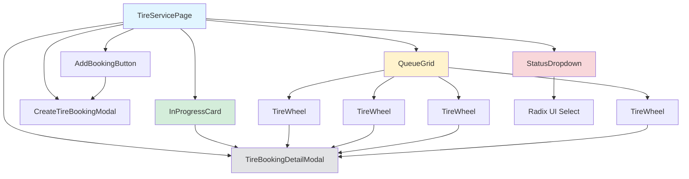

# План переработки дизайна шиномонтажа

## 📋 Обзор задачи

Переработать интерфейс страницы шиномонтажа для улучшения UX и визуальной структуры.

### Ключевые изменения:
1. **Единый блок** для всей страницы шиномонтажа
2. **Карточка "В РАБОТЕ"** с полной информацией о заказе
3. **Очередь в два ряда** с уменьшенными колёсами (только время)
4. **Dropdown меню** для "Готово" и "Отменено" (Radix UI Select)
5. **Форма создания заказа** при нажатии "Добавить новую запись"

---

## 🎨 Визуальная структура

```
┌─────────────────────────────────────────────────────────┐
│  🟢 В РАБОТЕ                                            │
│  ┌─────────────────────────────────────────────────┐   │
│  │  🛞    11:00 • Алексей М.                       │   │
│  │       Toyota Camry • A333AA                      │   │
│  │       Замена 4 колес • 2500₽                     │   │
│  └─────────────────────────────────────────────────┘   │
│                                                         │
│  ───────────────────────────────────────────────────── │
│                                                         │
│  🟡 ОЧЕРЕДЬ (4 заказа)                                │
│  ┌─────────┐ ┌─────────┐ ┌─────────┐ ┌─────────┐      │
│  │   🛞    │ │   🛞    │ │   🛞    │ │   🛞    │      │
│  │  12:00  │ │ ~13:00  │ │  14:00  │ │  15:30  │      │
│  └─────────┘ └─────────┘ └─────────┘ └─────────┘      │
│  ┌─────────┐ ┌─────────┐ ┌─────────┐ ┌─────────┐      │
│  │   🛞    │ │   🛞    │ │   🛞    │ │   🛞    │      │
│  │  16:00  │ │  17:00  │ │  18:00  │ │  19:00  │      │
│  └─────────┘ └─────────┘ └─────────┘ └─────────┘      │
│                                                         │
│  ┌─────────────────────────────────────────────────┐   │
│  │  [+] Добавить новую запись                     │   │
│  └─────────────────────────────────────────────────┘   │
│                                                         │
│  ───────────────────────────────────────────────────── │
│                                                         │
│  ⚪ Готово: 3  [▼]        🔴 Отменено: 1  [▼]        │
└─────────────────────────────────────────────────────────┘
```

---

## 🏗️ Структура компонентов

### Новые компоненты:
1. **`TireServicePage.tsx`** — главный компонент страницы (обёртка)
2. **`InProgressCard.tsx`** — карточка "В РАБОТЕ" с полной информацией
3. **`QueueGrid.tsx`** — сетка колёс для очереди (2 колонки)
4. **`TireWheel.tsx`** — компонент колеса (уменьшенный размер, только время)
5. **`AddBookingButton.tsx`** — кнопка "Добавить новую запись"
6. **`CreateTireBookingModal.tsx`** — форма создания заказа
7. **`StatusDropdown.tsx`** — Dropdown меню для "Готово" и "Отменено" (Radix UI Select)

### Модифицируемые компоненты:
1. **`TireBookingsList.tsx`** — полная переработка структуры
2. **`TireBookingCard.tsx`** — удалить (заменить на TireWheel)
3. **`TireBookingDetailModal.tsx`** — переиспользовать без изменений

---

## 📊 Диаграмма компонентов



---

## 🔧 Технические требования

### Зависимости (уже установлены):
- ✅ `@radix-ui/react-select` — для dropdown меню
- ✅ `@radix-ui/react-dialog` — для модальных окон
- ✅ `lucide-react` — иконки
- ✅ `tailwindcss` — стилизация

### Размеры колёс:
- Текущий размер: `w-24 h-24` (96px)
- Новый размер: `w-16 h-16` (32px) — уменьшенный для сетки 2 колонки

### Grid layout для очереди:
```css
grid-template-columns: repeat(2, minmax(0, 1fr));
gap: 1rem;
```

---

## 📝 Пошаговый план реализации

### Шаг 1: Создать новый компонент страницы
**Файл:** `components/admin/TireServicePage.tsx`

**Задачи:**
- Создать основную обёртку с единым блоком
- Разделить на секции: "В РАБОТЕ", "ОЧЕРЕДЬ", "Готово/Отменено"
- Добавить разделители между секциями

---

### Шаг 2: Создать карточку "В РАБОТЕ"
**Файл:** `components/admin/InProgressCard.tsx`

**Интерфейс:**
```typescript
interface InProgressCardProps {
  booking: Booking;
  onClick: () => void;
}
```

**UI:**
- Прямоугольная карточка с зелёной рамкой
- Иконка колеса слева
- Информация справа:
  - Время • Имя клиента
  - Автомобиль • Госномер
  - Услуга • Цена

---

### Шаг 3: Создать компонент колеса (уменьшенный)
**Файл:** `components/admin/TireWheel.tsx`

**Интерфейс:**
```typescript
interface TireWheelProps {
  time: string;
  status: BookingStatus;
  onClick: () => void;
}
```

**UI:**
- Размер: `w-12 h-12` (32px)
- Показывает только время в центре
- Цвет зависит от статуса:
  - ОЖИДАЕТ: жёлтый
  - В РАБОТЕ: зелёный
  - ГОТОВО: серый
  - ОТМЕНЕНО: красный

---

### Шаг 4: Создать сетку очереди
**Файл:** `components/admin/QueueGrid.tsx`

**Интерфейс:**
```typescript
interface QueueGridProps {
  bookings: Booking[];
  onBookingClick: (bookingId: string) => void;
  onAddBooking: () => void;
}
```

**UI:**
- Grid layout: 2 колонки
- Каждое колесо — компонент `TireWheel`
- Кнопка "Добавить новую запись" внизу

---

### Шаг 5: Создать Dropdown меню для статусов
**Файл:** `components/admin/StatusDropdown.tsx`

**Интерфейс:**
```typescript
interface StatusDropdownProps {
  status: 'done' | 'cancelled';
  bookings: Booking[];
  onBookingSelect: (bookingId: string) => void;
}
```

**UI:**
- Кнопка с количеством и иконкой dropdown
- Radix UI Select для списка заказов
- При выборе → открывает `TireBookingDetailModal`

---

### Шаг 6: Создать форму создания заказа
**Файл:** `components/admin/CreateTireBookingModal.tsx`

**Интерфейс:**
```typescript
interface CreateTireBookingModalProps {
  isOpen: boolean;
  onClose: () => void;
  onCreate: (booking: Omit<Booking, 'id'>) => void;
}
```

**Поля формы:**
- Время (time picker)
- Имя клиента (text input)
- Автомобиль (text input)
- Госномер (text input)
- Услуга (select: шиномонтаж 4 колеса, 2 колеса, балансировка, ремонт шины, вентиль, хранение)
- Способ оплаты (select: наличные, карта, перевод)

---

### Шаг 7: Переработать TireBookingsList
**Файл:** `components/admin/TireBookingsList.tsx`

**Изменения:**
- Заменить текущую структуру на новую
- Использовать новые компоненты:
  - `InProgressCard` для "В РАБОТЕ"
  - `QueueGrid` для "ОЧЕРЕДЬ"
  - `StatusDropdown` для "Готово" и "Отменено"
- Удалить старые компоненты `TireBookingCard` и `AddTireCard`

---

### Шаг 8: Обновить роутинг
**Файл:** `app/admin.tsx` или аналогичный

**Изменения:**
- Заменить `TireBookingsList` на `TireServicePage`
- Передать необходимые пропсы

---

### Шаг 9: Удалить устаревшие файлы
**Файлы для удаления:**
- `components/admin/TireBookingCard.tsx` (заменён на `TireWheel.tsx`)

---

## 🎯 Типы данных

### Booking (уже существует в types/index.ts):
```typescript
interface Booking {
  id: string;
  clientName: string;
  carModel: string;
  plateNumber: string;
  startTime: string;
  services: TireService[];
  price: number;
  paymentMethod: string;
  status: 'ОЖИДАЕТ' | 'В РАБОТЕ' | 'ГОТОВО' | 'ОТМЕНЕНО';
}
```

### TireService (уже существует):
```typescript
enum TireService {
  TIRE_CHANGE_4 = 'tire_change_4',
  TIRE_CHANGE_2 = 'tire_change_2',
  BALANCING = 'balancing',
  STORAGE = 'storage',
  REPAIR = 'repair',
  VALVE = 'valve',
}
```

---

## 📦 Структура файлов

```
components/admin/
├── TireServicePage.tsx          # Новый - главная страница
├── InProgressCard.tsx           # Новый - карточка В РАБОТЕ
├── QueueGrid.tsx                # Новый - сетка очереди
├── TireWheel.tsx                # Новый - компонент колеса
├── AddBookingButton.tsx         # Новый - кнопка добавления
├── CreateTireBookingModal.tsx   # Новый - форма создания
├── StatusDropdown.tsx           # Новый - dropdown для статусов
├── TireBookingsList.tsx         # Модифицировать - переработать
├── TireBookingDetailModal.tsx   # Без изменений - переиспользовать
└── TireBookingCard.tsx          # Удалить - заменён на TireWheel
```

---

## ✅ Чеклист завершения

- [ ] Создан `TireServicePage.tsx` с единой обёрткой
- [ ] Создан `InProgressCard.tsx` с полной информацией
- [ ] Создан `TireWheel.tsx` (уменьшенный, только время)
- [ ] Создан `QueueGrid.tsx` с grid layout 2 колонки
- [ ] Создан `StatusDropdown.tsx` с Radix UI Select
- [ ] Создан `CreateTireBookingModal.tsx` с формой
- [ ] Переработан `TireBookingsList.tsx`
- [ ] Удалён `TireBookingCard.tsx`
- [ ] Обновлён роутинг
- [ ] Проверена работа всех взаимодействий:
  - [ ] Клик на колесо → открывается детализация
  - [ ] Клик на карточку "В РАБОТЕ" → открывается детализация
  - [ ] Кнопка "Добавить" → открывается форма
  - [ ] Dropdown "Готово" → список заказов → детализация
  - [ ] Dropdown "Отменено" → список заказов → детализация

---

## 🎨 Цветовая схема

### Статусы:
- 🟢 В РАБОТЕ: `bg-green-500`, `border-green-600`
- 🟡 ОЖИДАЕТ: `bg-yellow-500`, `border-yellow-600`
- ⚪ ГОТОВО: `bg-gray-400`, `border-gray-500`
- 🔴 ОТМЕНЕНО: `bg-red-500`, `border-red-600`

### Разделители:
- Горизонтальная линия: `border-t border-gray-200`

---

## 🚀 Порядок разработки

1. **TireWheel.tsx** — базовый компонент колеса
2. **InProgressCard.tsx** — карточка В РАБОТЕ
3. **QueueGrid.tsx** — сетка очереди
4. **StatusDropdown.tsx** — dropdown меню
5. **CreateTireBookingModal.tsx** — форма создания
6. **TireServicePage.tsx** — главная страница (сборка)
7. **TireBookingsList.tsx** — переработка
8. **Удаление TireBookingCard.tsx**
9. **Обновление роутинга**
10. **Тестирование**

---

## 📝 Заметки

- Использовать существующий `TireBookingDetailModal` для детализации заказов
- Radix UI Select уже установлен в проекте
- Все типы данных уже существуют в `types/index.ts`
- Следовать правилам из `.kilocode/rules/`:
  - Никакого `any` в TypeScript
  - Логика в `features/`, не в компонентах
  - Переиспользование компонентов
  - Константы в `shared/config/`
