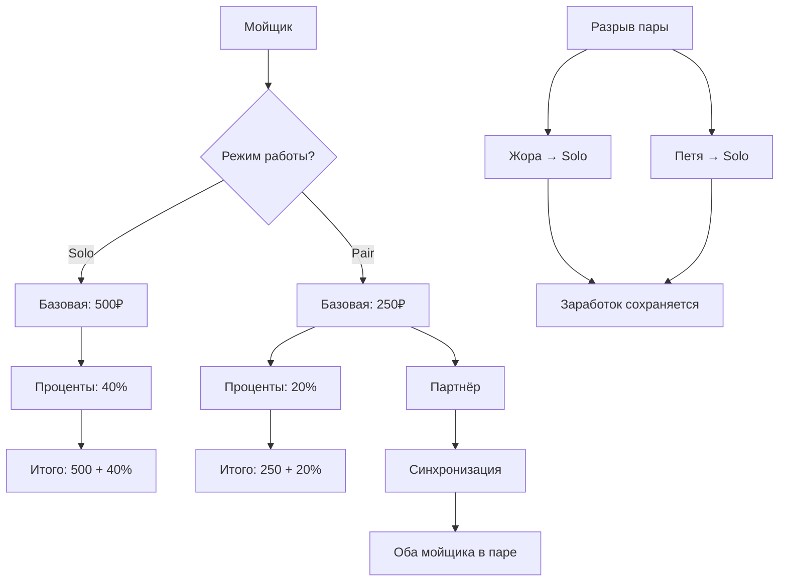

# План реализации: Работа в паре

## Требования

1. **Валидация партнёра:** Нельзя создать пару, если партнёр уже в другой паре
2. **Разрыв пары:** Если один мойщик переключается на solo, то другой партнёр тоже становится solo, но заработок сохраняется
3. **Отображение в карточке заказа:** Показывать "Пара" вместо имён, при клике - показать "Жора + Петя"
4. **История:** Хранить индивидуальный расчёт для каждого мойщика. Если работали в паре - записывать 20% для каждого. При переходе на solo - история сохраняется

---

## Что нужно сделать

### 1. Обновить типы (types.ts)

Добавить новые типы и поля:

```typescript
export type WorkingMode = 'solo' | 'pair';

export interface Worker {
  id: string;
  name: string;
  phone: string;
  carsToday: number;
  earnedToday: number;
  completedBookings: string[];
  isActive: boolean;
  status: 'FREE' | 'BUSY';
  cardDetails?: string;
  isWorkingToday: boolean;
  
  // Новые поля для работы в паре
  workingMode: WorkingMode; // 'solo' или 'pair'
  partnerId?: string; // ID партнёра, если workingMode = 'pair'
}
```

### 2. Обновить конфиг (shared/config/worker.ts)

Добавить настройки для работы в паре:

```typescript
export const WORKER_CONFIG = {
  BASE_SALARY: 500,
  BASE_SALARY_PAIR: 250, // Базовая ставка при работе в паре
  PERCENTAGE: 0.4,
  PERCENTAGE_PAIR: 0.2, // 20% каждому при работе в паре
} as const;
```

### 3. Обновить calculateEarnings.ts

#### 3.1. Обновить initializeWorkersDay()
Добавить инициализацию `workingMode: 'solo'` для всех мойщиков

#### 3.2. Добавить функцию toggleWorkerWorkingMode()
```typescript
export function toggleWorkerWorkingMode(
  workers: Worker[],
  workerId: string,
  mode: WorkingMode,
  partnerId?: string
): Worker[] {
  return workers.map(worker => {
    // Обрабатываем переключающегося мойщика
    if (worker.id === workerId) {
      if (mode === 'solo') {
        // Если переключаем на solo - сбрасываем партнёра
        return {
          ...worker,
          workingMode: 'solo',
          partnerId: undefined,
          earnedToday: worker.isWorkingToday ? WORKER_CONFIG.BASE_SALARY : 0,
        };
      }
      
      // Если переключаем на pair - устанавливаем партнёра
      return {
        ...worker,
        workingMode: 'pair',
        partnerId,
        earnedToday: worker.isWorkingToday ? WORKER_CONFIG.BASE_SALARY_PAIR : 0,
      };
    }
    
    // Обрабатываем бывшего партнёра (если есть)
    if (worker.partnerId === workerId && mode === 'solo') {
      return {
        ...worker,
        workingMode: 'solo',
        partnerId: undefined,
        earnedToday: worker.isWorkingToday ? WORKER_CONFIG.BASE_SALARY : 0,
      };
    }
    
    return worker;
  });
}
```

#### 3.3. Обновить calculateWorkerEarnings()
Добавить логику расчёта для пар:
- Если `workingMode = 'pair'` → использовать `PERCENTAGE_PAIR` (20%)
- Если `workingMode = 'solo'` → использовать `PERCENTAGE` (40%)

#### 3.4. Обновить toggleWorkerWorkingToday()
При переключении "Работает сегодня" учитывать режим работы:
- Solo: базовая 500₽
- Pair: базовая 250₽

### 4. Обновить Workers.tsx

**ВАЖНО:** Переключатель "Работает сегодня" **остаётся без изменений**. Добавляется **дополнительный** селектор режима работы.

#### 4.1. Добавить селектор режима работы
Рядом с Toggle "Работает сегодня" добавить:
```
Режим работы: [Solo] [Pair]
```

**Логика:**
- Если "Работает сегодня" выключен → селектор режима недоступен (disabled)
- Если "Работает сегодня" включен → можно выбрать Solo или Pair

#### 4.2. Добавить выбор партнёра
Если выбран режим "Pair" → показать выпадающий список:
```
Партнёр: [Выберите мойщика ▼]
```

**Логика фильтрации партнёров:**
- Показывать только тех, кто `isWorkingToday = true`
- Показывать только тех, у кого `workingMode = 'solo'` (не в паре)
- Исключать самого себя

#### 4.3. Обновить отображение условий
- Solo: `Условия: 500₽ + 40%`
- Pair: `Условия: 250₽ + 20% (пара с Петя)`

#### 4.4. Добавить обработчик onToggleWorkerWorkingMode
```typescript
const handleToggleWorkingMode = (workerId: string, mode: WorkingMode, partnerId?: string) => {
  onToggleWorkerWorkingMode?.(workerId, mode, partnerId);
};
```

### 5. Обновить AssignWorkerModal.tsx

#### 5.1. Обновить логику фильтрации
- Если мойщик работает solo → показывать как один вариант
- Если мойщик работает в паре → показывать **оба** мойщика как один вариант:
  ```
  [Жора + Петя] (пара)
  ```

**Логика группировки:**
- Создать массив доступных "рабочих единиц" (solo workers + pairs)
- Для пары использовать ID первого мойщика как workerId в заказе
- При выборе пары → назначить обоих мойщиков на заказ

#### 5.2. Обновить отображение
```
Жора (solo)
Петя (solo)
Жора + Петя (пара)
```

### 6. Обновить WorkerBookingsList.tsx

#### 6.1. Показывать партнёра
Если `workingMode = 'pair'` и `partnerId`:
```
Жора (работает с Петей)
```

#### 6.2. Обновить отображение заработка
- Solo: `Базовая: 500₽ | Проценты: 720₽ | Итого: 1220₽`
- Pair: `Базовая: 250₽ | Проценты: 360₽ | Итого: 610₽`

#### 6.3. Показывать режим работы в истории
В списке заказов добавить индикатор режима:
```
1800₽ • 20% (пара) • 360₽
```

### 7. Обновить Dashboard.tsx / BookingsList.tsx

#### 7.1. Обновить отображение мойщика в карточке заказа
Вместо имени мойщика показывать:
- Solo: "Жора"
- Pair: "Пара" (кликабельно, при клике - показать "Жора + Петя")

**Реализация:**
- Добавить состояние `showPairDetails: { [bookingId: string]: boolean }`
- При клике на "Пара" → переключить состояние для этого заказа
- Показывать полное название пары если `showPairDetails[bookingId] = true`

#### 7.2. Обновить getWorkerName()
```typescript
const getWorkerName = (workerId: string | undefined, workers?: Worker[]): string => {
  if (!workerId || !workers) return '';
  
  const worker = workers.find(w => w.id === workerId);
  if (!worker) return '';
  
  // Если работает в паре - показывать "Пара"
  if (worker.workingMode === 'pair' && worker.partnerId) {
    const partner = workers.find(w => w.id === worker.partnerId);
    return partner ? `${worker.name} + ${partner.name}` : worker.name;
  }
  
  return worker.name;
};
```

### 8. Обновить App.tsx

#### 8.1. Добавить обработчик onToggleWorkerWorkingMode
```typescript
const handleToggleWorkerWorkingMode = (workerId: string, mode: WorkingMode, partnerId?: string) => {
  setWorkers(prevWorkers => toggleWorkerWorkingMode(prevWorkers, workerId, mode, partnerId));
};
```

#### 8.2. Передать обработчик в Workers компонент
```typescript
<Workers
  onToggleWorkerWorkingMode={handleToggleWorkerWorkingMode}
  // ... остальные пропсы
/>
```

#### 8.3. Обновить mock данные
Добавить `workingMode: 'solo'` для всех мойщиков

---

## Логика работы

### Создание пары
1. Админ выбирает режим "Pair" для Жоры
2. Админ выбирает партнёра Петя из списка (только свободные solo workers)
3. Жора и Петя переключаются в режим `pair`:
   - Жора: `workingMode = 'pair'`, `partnerId = 'пети_id'`, `earnedToday = 250`
   - Петя: `workingMode = 'pair'`, `partnerId = 'жоры_id'`, `earnedToday = 250`

### Разрыв пары
1. Админ переключает Жору на режим "Solo"
2. Жора переключается в режим `solo`:
   - Жора: `workingMode = 'solo'`, `partnerId = undefined`, `earnedToday = 500`
3. Петя автоматически переключается в режим `solo`:
   - Петя: `workingMode = 'solo'`, `partnerId = undefined`, `earnedToday = 500`
4. Заработок сохраняется (история заказов не удаляется)

### Назначение заказа на пару
1. Админ открывает AssignWorkerModal
2. Видит список:
   ```
   Жора (solo)
   Петя (solo)
   Жора + Петя (пара)
   ```
3. Выбирает "Жора + Петя (пара)"
4. Заказ назначается на Жору (`workerId = 'жоры_id'`)
5. При расчёте заработка:
   - Жора получает: 250₽ (базовая) + 20% × 1800₽ = 610₽
   - Петя получает: 250₽ (базовая) + 20% × 1800₽ = 610₽

### Отображение в карточке заказа
- Solo: "Жора"
- Pair: "Пара" (при клике → "Жора + Петя")

---

## Пример

**Сценарий: Жора и Петя работают в паре**

1. **Создание пары:**
   - Жора переключается на "Pair", выбирает Петю
   - Жора: `workingMode = 'pair'`, `partnerId = 'пети_id'`, `earnedToday = 250`
   - Петя: `workingMode = 'pair'`, `partnerId = 'жоры_id'`, `earnedToday = 250`

2. **Заказ 1 (1800₽) выполнен парой:**
   - Жора: `earnedToday = 250 + 360 = 610₽`
   - Петя: `earnedToday = 250 + 360 = 610₽`
   - В истории Жоры: `1800₽ • 20% (пара) • 360₽`
   - В истории Пети: `1800₽ • 20% (пара) • 360₽`

3. **Заказ 2 (3500₽) выполнен парой:**
   - Жора: `earnedToday = 610 + 700 = 1310₽`
   - Петя: `earnedToday = 610 + 700 = 1310₽`

4. **Жора переключается на solo:**
   - Жора: `workingMode = 'solo'`, `partnerId = undefined`, `earnedToday = 500`
   - Петя: `workingMode = 'solo'`, `partnerId = undefined`, `earnedToday = 500`
   - История заказов сохраняется (20% за первые два заказа)

5. **Заказ 3 (2000₽) выполнен Жорой solo:**
   - Жора: `earnedToday = 500 + 800 = 1300₽`
   - Петя: `earnedToday = 500` (без изменений)

6. **Итого за день:**
   - Жора: 500 (базовая) + 360 (20% × 1800) + 700 (20% × 3500) + 800 (40% × 2000) = **2360₽**
   - Петя: 500 (базовая) + 360 (20% × 1800) + 700 (20% × 3500) = **1560₽**

---

## Диаграмма логики



---

## Чеклист реализации

- [ ] Обновить тип Worker в types.ts
- [ ] Обновить WORKER_CONFIG в shared/config/worker.ts
- [ ] Обновить initializeWorkersDay() в calculateEarnings.ts
- [ ] Добавить toggleWorkerWorkingMode() в calculateEarnings.ts
- [ ] Обновить calculateWorkerEarnings() в calculateEarnings.ts
- [ ] Обновить toggleWorkerWorkingToday() в calculateEarnings.ts
- [ ] Обновить Workers.tsx - добавить селектор режима
- [ ] Обновить Workers.tsx - добавить выбор партнёра
- [ ] Обновить Workers.tsx - обновить отображение условий
- [ ] Обновить AssignWorkerModal.tsx - группировка пар
- [ ] Обновить WorkerBookingsList.tsx - показать партнёра
- [ ] Обновить WorkerBookingsList.tsx - показать режим в истории
- [ ] Обновить Dashboard.tsx - отображение "Пара"
- [ ] Обновить BookingsList.tsx - отображение "Пара"
- [ ] Обновить App.tsx - добавить обработчик
- [ ] Обновить mock данные
