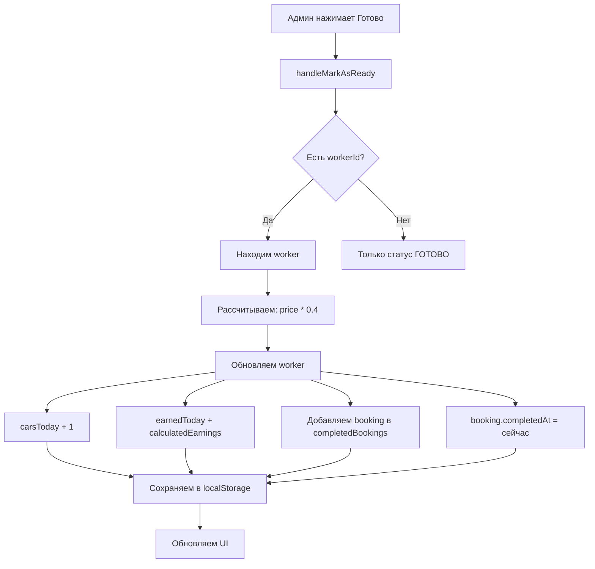

# План: Система расчета зарплаты мойщиков

## 📋 Описание задачи

Когда админ нажимает "Готово" в деталях заказа:
1. Заказ помечается как выполненный
2. Мойщику, который выполнял заказ, добавляется этот заказ в его статистику
3. Рассчитывается зарплата: **500₽ (базовая за выход) + 40% от стоимости каждого заказа**

## 🏗️ Архитектура

### Диаграмма потока данных



### Структура данных

```typescript
// types.ts - обновленные типы
interface Worker {
  id: string;
  name: string;
  phone: string;
  carsToday: number;           // Количество помытых машин за текущий день
  earnedToday: number;          // Заработано за текущий день (500 базовая + проценты)
  completedBookings: string[]; // ID выполненных заказов за текущий день
  isActive: boolean;
  status: 'FREE' | 'BUSY';
  cardDetails?: string;
}

interface Booking {
  id: string;
  // ... существующие поля
  workerId?: string;
  status: 'ОЖИДАЕТ' | 'В РАБОТЕ' | 'ГОТОВО' | 'ОТМЕНЕНО';
  completedAt?: string;         // Когда был помечен как ГОТОВО (ISO timestamp)
  price: number;
  // ... остальные поля
}
```

### Константы

```typescript
// shared/config/worker.ts
export const WORKER_CONFIG = {
  BASE_SALARY: 500,      // Базовая ставка за выход (один раз в день)
  PERCENTAGE: 0.4,       // 40% от стоимости заказа
} as const;
```

### Функции бизнес-логики

```typescript
// features/workers/calculateEarnings.ts
import { WORKER_CONFIG } from '@/shared/config/worker';

/**
 * Рассчитывает процент от стоимости заказа
 * @param orderPrice - стоимость заказа
 * @returns заработок с этого заказа (40%)
 */
export function calculateOrderEarnings(orderPrice: number): number {
  return orderPrice * WORKER_CONFIG.PERCENTAGE;
}

/**
 * Инициализирует начало дня для всех мойщиков
 * Сбрасывает статистику и устанавливает базовую ставку 500₽
 * @param workers - массив мойщиков
 * @returns массив мойщиков с инициализированным днем
 */
export function initializeWorkersDay(workers: Worker[]): Worker[] {
  return workers.map(worker => ({
    ...worker,
    carsToday: 0,
    earnedToday: WORKER_CONFIG.BASE_SALARY,
    completedBookings: [],
  }));
}

/**
 * Добавляет выполненный заказ в статистику мойщика
 * @param workers - массив всех мойщиков
 * @param workerId - ID мойщика
 * @param bookingId - ID выполненного заказа
 * @param bookingPrice - стоимость заказа
 * @returns обновленный массив мойщиков
 */
export function addCompletedBookingToWorker(
  workers: Worker[],
  workerId: string,
  bookingId: string,
  bookingPrice: number
): Worker[] {
  return workers.map(worker => {
    if (worker.id !== workerId) return worker;

    const earnings = calculateOrderEarnings(bookingPrice);

    return {
      ...worker,
      carsToday: worker.carsToday + 1,
      earnedToday: worker.earnedToday + earnings,
      completedBookings: [...worker.completedBookings, bookingId],
    };
  });
}

/**
 * Получает выполненные заказы мойщика за текущий день
 * @param worker - мойщик
 * @param allBookings - все заказы
 * @param today - текущая дата (ISO string)
 * @returns заказы, выполненные сегодня
 */
export function getWorkerBookingsForToday(
  worker: Worker,
  allBookings: Booking[],
  today: string
): Booking[] {
  const todayStart = new Date(today);
  todayStart.setHours(0, 0, 0, 0);

  const todayEnd = new Date(today);
  todayEnd.setHours(23, 59, 59, 999);

  return allBookings.filter(booking => {
    if (!worker.completedBookings.includes(booking.id)) return false;
    if (!booking.completedAt) return false;

    const completedDate = new Date(booking.completedAt);
    return completedDate >= todayStart && completedDate <= todayEnd;
  });
}
```

## 📁 Изменения в файлах

### 1. Обновить типы (types.ts)
- Добавить `completedBookings: string[]` в `Worker`
- Добавить `completedAt?: string` в `Booking`

### 2. Создать конфиг (shared/config/worker.ts)
- Константы: `WORKER_CONFIG`

### 3. Создать функции (features/workers/)
- `calculateEarnings.ts` - логика расчета зарплаты

### 4. Обновить App.tsx
- Поднять `workers` state из `Workers.tsx`
- Добавить `initializeWorkersDay()` для начала дня
- Обновить `handleMarkAsReady()` с расчетом зарплаты
- Добавить сохранение/восстановление workers из localStorage

### 5. Обновить Workers.tsx
- Принимать `workers` и `setWorkers` как props
- Добавить dropdown с историей помытых машин
- Добавить кнопку для показа списка заказов за текущий день

### 6. Создать WorkerBookingsList.tsx
- Показывать список выполненных заказов за текущий день
- Детали каждого заказа: клиент, машина, услуги, стоимость, заработок (40%)

## 🔐 Сохранение в localStorage

```typescript
// Ключ: 'workersState'
// Структура:
{
  date: '2025-01-15',        // Дата дня (YYYY-MM-DD)
  workers: Worker[]           // Состояние всех мойщиков
}

// Проверка на 00:00:
// Если сохраненная дата !== сегодняшней → initializeWorkersDay()
```

## 📊 UI Changes

### Карточка мойщика (Workers.tsx)
```
┌─────────────────────────────────┐
│ Вася                    Активен │
│ +7 999 987-65-43                 │
│                                  │
│ ┌─────────────┬────────────────┐ │
│ │Машин сегодня│ Заработано     │ │
│ │     6       │ 10,100 ₽       │ │
│ └─────────────┴────────────────┘ │
│                                  │
│ Условия: 500₽ + 40%              │
│                                  │
│ [📋 История машин] [📅 Сегодня]   │
└─────────────────────────────────┘
```

### Dropdown история машин
```
┌─────────────────────────────────┐
│ История машин                    │
├─────────────────────────────────┤
│ Mercedes E-class                 │
│ Чек: 1800 ₽ | Заработок: 720 ₽  │
├─────────────────────────────────┤
│ BMW X5                           │
│ Чек: 3500 ₽ | Заработок: 1400 ₽ │
├─────────────────────────────────┤
│ Toyota Camry                     │
│ Чек: 2000 ₽ | Заработок: 800 ₽  │
└─────────────────────────────────┘
```

### Список заказов за сегодня (WorkerBookingsList)
```
┌─────────────────────────────────┐
│ ← Вася - Заказы за сегодня      │
├─────────────────────────────────┤
│ 1. Mercedes E-class             │
│    Клиент: Иван П.              │
│    Гос. номер: E777KX           │
│    Услуги: Кузов, Салон         │
│    Чек: 1800 ₽                  │
│    Заработок: +720 ₽ (40%)     │
├─────────────────────────────────┤
│ 2. BMW X5                       │
│    Клиент: ООО Ромашка          │
│    Гос. номер: O001OO           │
│    Услуги: Кузов, Багажник      │
│    Чек: 3500 ₽                  │
│    Заработок: +1400 ₽ (40%)     │
├─────────────────────────────────┤
│ Итого за сегодня:               │
│ База: 500 ₽                     │
│ Проценты: 2120 ₽                │
│ Всего: 2620 ₽                   │
└─────────────────────────────────┘
```

## ✅ Чеклист реализации

- [ ] Обновить типы в `types.ts`
- [ ] Создать `shared/config/worker.ts`
- [ ] Создать `features/workers/calculateEarnings.ts`
- [ ] Поднять `workers` state в `App.tsx`
- [ ] Добавить инициализацию дня в `App.tsx`
- [ ] Обновить `handleMarkAsReady` с расчетом зарплаты
- [ ] Добавить localStorage для workers
- [ ] Создать `WorkerBookingsList.tsx`
- [ ] Создать `WorkerHistoryDropdown` компонент
- [ ] Обновить `Workers.tsx` с новым UI
- [ ] Тестирование логики

## 🧪 Пример работы

**Начало дня:**
```
Вася: carsToday = 0, earnedToday = 500₽ (базовая)
```

**Заказ 1 (1800₽):**
```
Админ нажимает Готово →
Заработок = 1800 * 0.4 = 720₽
Вася: carsToday = 1, earnedToday = 500 + 720 = 1220₽
```

**Заказ 2 (3500₽):**
```
Админ нажимает Готово →
Заработок = 3500 * 0.4 = 1400₽
Вася: carsToday = 2, earnedToday = 1220 + 1400 = 2620₽
```

**Итого за день:**
```
Вася помыл 2 машины и заработал:
- База: 500 ₽
- Заказ 1: 720 ₽ (40% от 1800)
- Заказ 2: 1400 ₽ (40% от 3500)
- ВСЕГО: 2620 ₽
```
